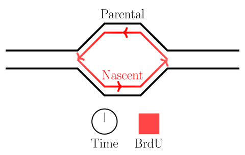

In this session, we will perform reference-anchored modification calling
on the dataset we have been using thus far — yeast DNA where some thymidines have been
substituted by BrdU.
We will use the software program `DNAscent` on the files already generated
by us from previous sessions (pod5, bam, sequencing summary file).
Along the way, we will also learn the mod bam file format.
We will be performing the steps highlighted with an asterisk in the pipeline figure below.


## Running DNAscent to produce modification calls along each sequenced DNA strand

### Creating a DNAscent index

We now need to create an index needed by DNAscent — a plain text with two columns: read id
and the pod5 file with the corresponding time course of nanopore current.

```bash
input_pod5_dir=~/nanomod_course_data/yeast
output_index=~/nanomod_course_outputs/yeast/index.dnascent

DNAscent index -f $input_pod5_dir -o $output_index
```

### Call modifications

We run the reference-anchored modification caller `DNAscent detect` here.
The program takes alignment information from the bam file, a reference genome,
and the raw nanopore currents as inputs and outputs the probability of modification
per thymidine per sequenced strand in a `.mod.bam` format, which is just the BAM format
with some tags that stored modification information.
The program uses a machine-learning approach where model parameters learned previously
represent differences in nanopore current characteristics between thymidine and BrdU.

The additional options below direct the program to use
8 computational threads and to reject alignments below a mapping quality of 20 and
a genome-mapped length of 1000 bases. 
By omitting the `--GPU` input parameter, we are running DNAscent in a slow, CPU-only mode
as the virtual machines used in the course do not have GPUs to lower costs.

```bash
input_bam=~/nanomod_course_outputs/yeast/aligned_reads.sorted.onlyPrim.bam
ref_genome=~/nanomod_course_references/sacCer3.fa
index=~/nanomod_course_outputs/yeast/index.dnascent
output_mod_bam=~/nanomod_course_outputs/yeast/dnascent.mod.bam
DNAscent detect -b $input_bam -r $ref_genome -i $index \
 -o $output_mod_bam -t 8 -q 20 -l 1000

# it's a good idea to always sort and index BAM files
input_mod_bam=~/nanomod_course_outputs/yeast/dnascent.mod.bam
output_sorted_mod_bam=~/nanomod_course_outputs/yeast/dnascent.mod.sorted.bam
samtools sort -o $output_sorted_mod_bam $input_mod_bam
samtools index $output_sorted_mod_bam
```

After the program has finished running, inspect the file using `nanalogue peek`.

```bash
mod_bam=~/nanomod_course_outputs/yeast/dnascent.mod.sorted.bam
nanalogue peek $mod_bam
```

You should see the details of the contigs in the BAM file along with two detected
modification types: 'b' and 'e'. These correspond to BrdU and EdU respectively.
As our data here contains only BrdU, we expect to see very few EdU calls.
DNAscent in its current version calls both types of mods simultaneously, and this
cannot be disabled. If you inspect modification counts per read using the following
command, you should expect to see many more BrdU calls than EdU calls per molecule.

```bash
mod_bam=~/nanomod_course_outputs/yeast/dnascent.mod.sorted.bam
nanalogue read-info $mod_bam | more
```

## Call replication dynamics with DNAscent forkSense using single-molecule modification densities

After modifications are called, one can ask general questions common to all modification experiments
like which are the highly modified reads, what is the mean density per read etc.
One can also ask specific questions that are experiment-dependent.

In the experiments of the yeast dataset we have been using,
the specific questions are about DNA replication dynamics.
Gradients in BrdU density across a read are associated with the movement of replication forks.
After fork calls are made, locations on the genome from which forks emerged are identified as
origins of replication, and locations where forks terminate are identified as termination sites.
Please see the figure below.



Here we will learn how to identify highly-modified reads, and associate features with them.
In the next session, we will learn how to visualize these reads as well.

The following nanalogue command sections each molecule in non-overlapping windows of size 300
thymidines each. It then asks "which molecules have atleast one window where the modification
level is above 40%?". 

```bash
mod_bam=~/nanomod_course_outputs/yeast/dnascent.mod.sorted.bam
highly_mod_reads=~/nanomod_course_outputs/yeast/highly_mod_reads
nanalogue find-modified-reads any-dens-above --high 0.4 --win 300 \
  --step 300 --tag b $mod_bam > $highly_mod_reads

# print contents of the file
cat $highly_mod_reads
```

You should see that out of the 60 or so reads that we mod-called, only nine contain
a BrdU window of significant modification.

Examine the modification patterns across these reads in non-overlapping windows of
size 300 thymidines each using the following command.

```bash
mod_bam=~/nanomod_course_outputs/yeast/dnascent.mod.sorted.bam
highly_mod_reads=~/nanomod_course_outputs/yeast/highly_mod_reads
windowed_data=~/nanomod_course_outputs/yeast/windowed_data
nanalogue window-dens --read-id-list $highly_mod_reads --win 300 \
  --step 300 --tag b $mod_bam > $windowed_data

# inspect the produced file with this command
more $windowed_data
```

Do you see patterns in the modification data? Can you pick out origins, forks etc.?


## Inspect modification data by conversion from modBAM to TSV format using modkit

Without a discussion, it is not easy to understand what is in a raw mod BAM file.
So, before the discussion, let us convert the mod BAM file into the easy-to-understand tab-separated value
format so that we can get a quick look at our modification calls.
We will be using the `modkit` program developed by ONT that takes mod BAM files as input
and produces tabulated data or summary statistics as output.
One of the functions provided is `modkit extract full`.

Please run the code below and inspect the output tsv file.
The most important columns are `read_id`, `forward_read_position`, and `mod_qual` as these answer
the fundamental question of modification calling: what is the likelihood of modification at every
position on every read?
Other useful columns are the position along the reference `ref_position`,
the length of the read `read_length` etc.
We can look up the full list in the official documentation [here](https://nanoporetech.github.io/modkit/intro_extract.html).

```bash
input_mod_bam=~/nanomod_course_outputs/yeast/dnascent.mod.sorted.bam
output_tsv=~/nanomod_course_outputs/yeast/dnascent.mod.sorted.bam.tsv
modkit extract full $input_mod_bam $output_tsv
```

<details markdown="1">

<summary markdown="span"> 

Optional: the modBAM format

</summary>

## Discussion of the modBAM file format

The mod BAM format is not very easy to read for a person.
Tools such as `modkit`, `samtools`, and `IGV` help us convert mod BAM files into an easily
readable format such as a table or an image.
You might find that such tools are adequate for your needs.
If you do not, then knowledge of the format helps you write tools yourself
and to perform some advanced manipulations.
As the modification field is still developing,
it is probable that you will come across such scenarios.
Thus, we conclude this session with a [discussion]({{ site.baseurl }}/materials/mod-bam-format)
 of the mod BAM file format.

 </details>
