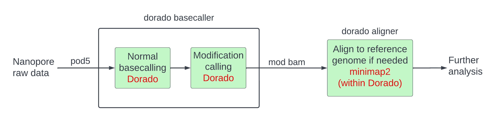

In this session, we will perform reference-independent modification calling
on a dataset of human DNA that naturally contains cytosines modified due to methylation.
We will use the basecaller `dorado` that can perform basecalling and modification
calling when we issue a single command.
We will follow the pipeline illustrated below.



As you can see from the figure, there are a few differences compared to the pipeline
we followed for the yeast dataset:
- The input format for nanopore currents is `pod5` instead of `fast5`.
- We are using the basecaller `dorado` instead of `guppy` and `dorado` performs the job
of `guppy`, `DNAscent`, and `minimap2` combined.
- Modification calling and basecalling are performed with a single `dorado basecaller` command,
although modification calling still follows basecalling.
- We get a mod BAM file directly from the modification caller,
so we do not need to perform any file format conversions.
- The workflow is reference-unanchored, so alignment is optional and follows modification calling.
Alignment is done through the `dorado aligner` command although it is just a different name for `minimap2`
which is doing the job under the hood.

We will be using a subset of the 'Cliveome' [dataset](https://labs.epi2me.io/cliveome_5mc_cfdna_celldna/)
developed by Oxford NanoporeTech.
We had performed a subset and some file conversions and calculations before the course began;
the steps are listed [here]({{ site.baseurl }}/data#Human) and you can read them later.
We have already copied this data to the location `~/nanomod_course_data/human/`
at the beginning of the course.

## Inspect input data

We can inspect the pod5 file to see how many reads are on it.

```bash
input_pod5=~/nanomod_course_data/human/PAM63974_pass_58881fec_60.twenty_random_reads.pod5
pod5 inspect summary $input_pod5
```

There are 20 reads here. The output should look like the following.

```text
File version in memory 0.3.2, read table version 3.
File version on disk 0.3.2.
File uses VBZ compression.
Batch 1, 20 reads
Found 1 batches, 20 reads
```

## Basecalling and modification calling

We need to download the model `dorado` uses for basecalling and modification calling.
We will put them in a suitable directory.

```bash
dorado_model_dir=~/nanomod_course_references/dorado_models
model_config=dna_r10.4.1_e8.2_400bps_hac@v3.5.2
mkdir -p $dorado_model_dir
dorado download --model $model_config --directory $dorado_model_dir
```

We make a directory to store our modification calls.

```bash
output_dir=~/nanomod_course_outputs/human
mkdir -p $output_dir
```

We can basecall and modification call ten of our reads (`-n 10`) with 5mC methylation.
NOTE: the `-b 10 -c 1000` are internal `dorado` parameters which we've chosen to fit
our virtual machines, and we are running in the slower CPU-only mode.
This step will take approximately ten minutes.

```bash
input_dir=~/nanomod_course_data/human
model_files=~/nanomod_course_references/dorado_models/dna_r10.4.1_e8.2_400bps_hac@v3.5.2
output_mod_bam=~/nanomod_course_outputs/human/PAM63974_pass_58881fec_60.ten_reads.mod.bam
dorado basecaller $model_files $input_dir \
  --verbose -n 10 -x cpu -b 10 -c 1000 --modified-bases 5mCG | \
    samtools view --threads 8 -O BAM -o $output_mod_bam
```

Note down the program speed in number of samples per second.

### Comparing our modification-calling speed with ONT's benchmarks

You can compare the dorado basecalling rate we have recorded in samples
per second to the ONT benchmarks listed [here](https://aws.amazon.com/blogs/hpc/benchmarking-the-oxford-nanopore-technologies-basecallers-on-aws/).
How much slower are we? Please note that some of ONT's benchmarks were performed
on computers with many GPUs which are expensive (see the cost tables at the link)!

### Dorado pipelines produce only BAM files but no fastq or sequencing summary files

You will see that this pipeline produces the mod BAM file directly
and no other file. If we perform alignment after modification calling,
as we shall do in a few moments, we will get another mod BAM file.
We do not get a fastq file or a sequencing summary file as we had
with the yeast pipeline.
We can generate a sequencing summary file if we wish to using the
`dorado summary` command as shown below.
This file is useful if we want to run tools like pycoQC.

```bash
input_mod_bam=~/nanomod_course_outputs/human/PAM63974_pass_58881fec_60.ten_reads.mod.bam
output_summ_file=~/nanomod_course_outputs/human/PAM63974_pass_58881fec_60.ten_reads.summary.txt
dorado summary $input_mod_bam > $output_summ_file
```

You can get a fastq file if you want using the command
`samtools bam2fq $input_mod_bam > $output_fastq` but we will not be doing it here.

### (optional) Dorado can detect multiple types of methylation

We are not going to call both 5hmC and 5mC methylation here, but you can use the flag
`--modified-bases 5mCG_5hmCG` to do so.

## Inspect results of modification calling

We can view the output modification data in tabular form with `modkit` as we have
learned in previous sessions.

```bash
input_mod_bam=~/nanomod_course_outputs/human/PAM63974_pass_58881fec_60.ten_reads.mod.bam
output_tsv=~/nanomod_course_outputs/human/PAM63974_pass_58881fec_60.ten_reads.mod.bam.tsv
samtools index $input_mod_bam
modkit extract $input_mod_bam $output_tsv
```

You can view a few rows of the `$output_tsv` file above.
As we've discussed in the [session]({{ site.baseurl }}/materials/base-mod-detection)
on modification detection in yeast, the most important columns are `read_id`,
`forward_read_position`, and `mod_qual`.
The reference-related columns have null values or equivalent as we have not
aligned the file to a reference genome thus far.
You can look up the full list of columns in the official documentation
[here](https://nanoporetech.github.io/modkit/intro_extract.html).

Do you see anything interesting in the `query_kmer` column?
The middle of the k-mer is the base of interest on
which modification has been called.
What base follows the cytosine of interest?

## Perform alignment post-modification calling

### Download the reference genome 

We need to download a reference human genome using the following steps.
Please note that `.fna` files are just a type of a fasta file.

```bash
cd ~/nanomod_course_references
url=https://ftp.ncbi.nlm.nih.gov/genomes/all/GCA/000/001/405/GCA_000001405.15_GRCh38/seqs_for_alignment_pipelines.ucsc_ids
wget "$url"/GCA_000001405.15_GRCh38_full_analysis_set.fna.fai
wget "$url"/GCA_000001405.15_GRCh38_full_analysis_set.fna.gz   
gunzip GCA_000001405.15_GRCh38_full_analysis_set.fna.gz
```

### Perform alignment

We perform alignment using the `dorado aligner` command which just runs `minimap2` under the hood.
The `-t 8` flag asks dorado to use 8 computational threads.

```bash
reference=~/nanomod_course_references/GCA_000001405.15_GRCh38_full_analysis_set.fna
cd ~/nanomod_course_outputs/human/
input_bam=PAM63974_pass_58881fec_60.ten_reads.mod.bam
output_bam=PAM63974_pass_58881fec_60.ten_reads.aligned.mod.bam
dorado aligner -t 8 $reference $input_bam > $output_bam
```

Let us sort and index the output bam file

```bash
cd ~/nanomod_course_outputs/human/
input_bam=PAM63974_pass_58881fec_60.ten_reads.aligned.mod.bam
output_bam=PAM63974_pass_58881fec_60.ten_reads.aligned.mod.sorted.bam
samtools sort -o $output_bam $input_bam
samtools index $output_bam
```

### Inspect alignment

We can use `modkit` to convert the output aligned file to TSV and then inspect it.

```bash
cd ~/nanomod_course_outputs/human/
input_mod_bam=PAM63974_pass_58881fec_60.ten_reads.aligned.mod.sorted.bam
output_tsv=PAM63974_pass_58881fec_60.ten_reads.aligned.mod.sorted.bam.tsv
modkit extract $input_mod_bam $output_tsv
```

We can also inspect the file using the `samtools` and `bedtools` commands
we have encountered throughout the course.

```bash
cd ~/nanomod_course_outputs/human/
input_mod_bam=PAM63974_pass_58881fec_60.ten_reads.aligned.mod.sorted.bam
samtools view -c $input_mod_bam # count number of reads
samtools view -c  --exclude-flags SECONDARY,SUPPLEMENTARY\
  $input_mod_bam                # count number of primary reads
bedtools bamtobed -i $input_mod_bam # inspect alignment coordinates
```

## Perform quality control with pycoQC

Like in a previous [session]({{ site.baseurl }}/materials/sequence-align-pycoqc)
on yeast, if we run quality control on the ten-read alignment file we have
been making, we will get warnings and poor statistics.
Due to the sensitive nature of human data, we are unable to store and
provide you with a sizeable subset of the Cliveome dataset using
which we can run pycoQC.
So, we have run pycoQC ourselves and give you the resultant reports.
Please go to the directory `~/nanomod_course_data/human` and open
the `analysis.html` file and have a look.

For your reference, we mention the pycoQC command used to
generate these reports below

```bash
# DO NOT run these commands.
# They are for your reference only.
# To run them, you need to download and prepare the 'Cliveome'
# dataset as described here: {{ site.baseurl }}/data#Human
# You can do so on your own computer (not the virtual machines
# used in the course) if you want to.
# For now, we just give you the results of the pycoQC step.
cd ~/nanomod_course_data/human/
input_dir= # this is an input directory on a different computer
seq_summ="$input_dir"/cliveome_kit14_2022.05/gdna/flowcells/ONLA29134/20220510_1127_5H_PAM63974_a5e7a202/sequencing_summary_PAM63974_58881fec.txt
alignment_bam="$input_dir"/cliveome_kit14_2022.05/gdna/basecalls/PAM63974/bonito_calls.bam
pycoQC -f $seq_summ -a $alignment_bam -o ./analysis.html -j ./analysis.json
```

## Further analysis

For further analysis, we have prepared a subset of the Cliveome dataset by choosing
reads passing through a specific region of the human genome.
It is located at `~/nanomod_course_data/human/bonito_calls.subset.sorted.bam`.

You can now explore the BAM file yourself using the tools we have talked about
so far. Or you can do one or some of the exercises below to explore the BAM
file in a guided way.

### Exercises

- [Exploring an unknown BAM file]({{ site.baseurl }}/exercises/bam_exploration).
- [Are all C methylations at CpG sites?]({{ site.baseurl }}/exercises/cpg_exploration).
- [Find the most modified reads]({{ site.baseurl }}/exercises/most_modified).