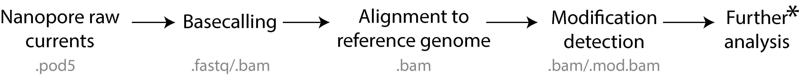
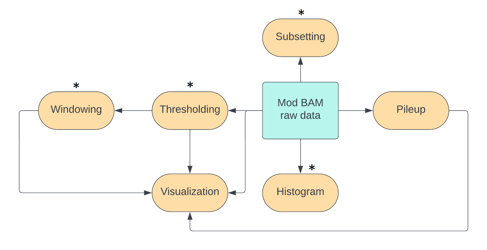
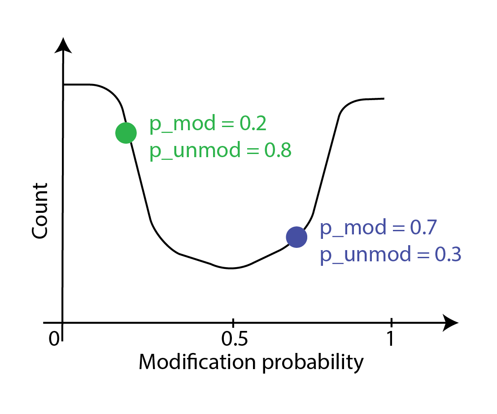
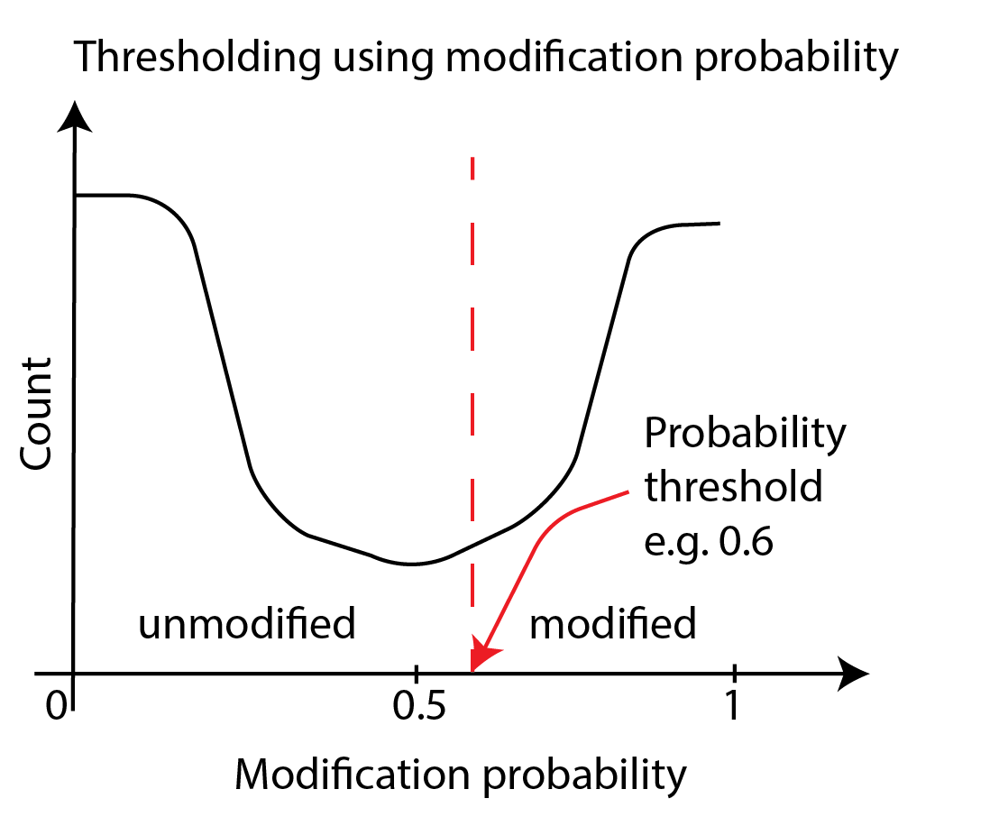
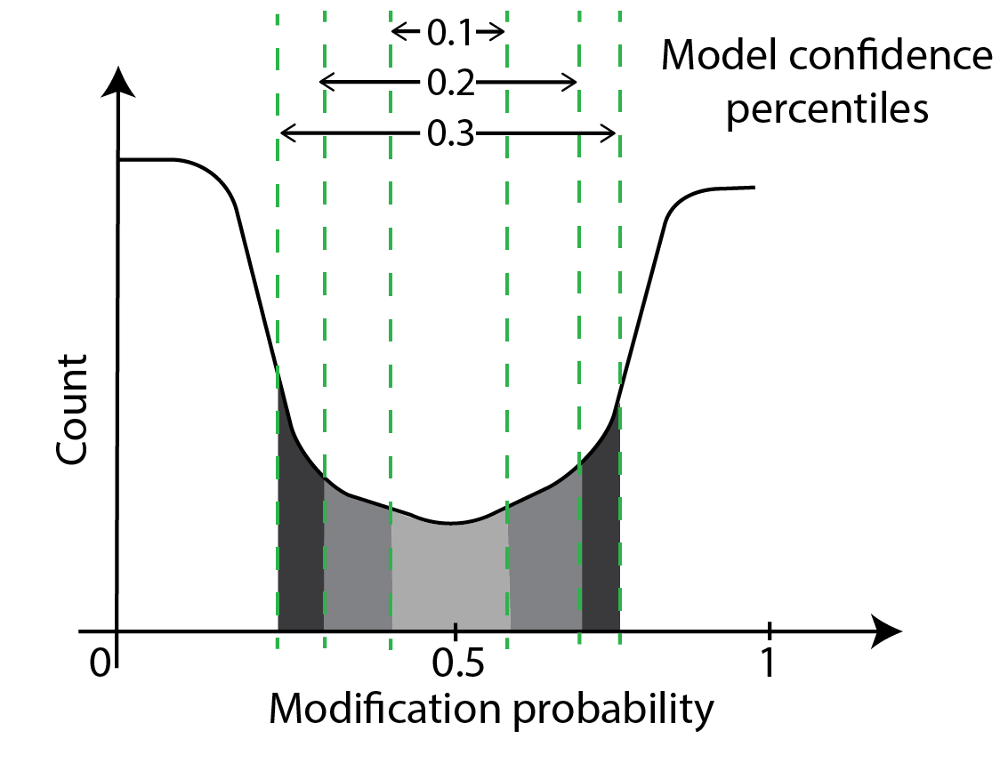
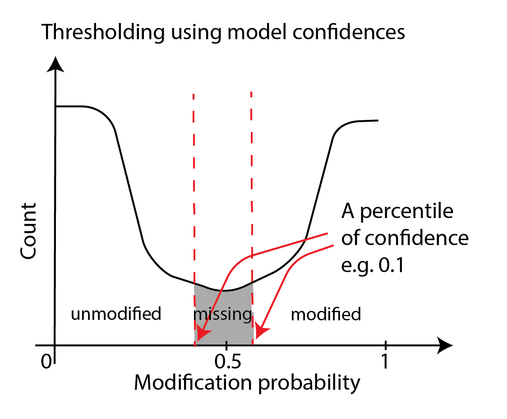
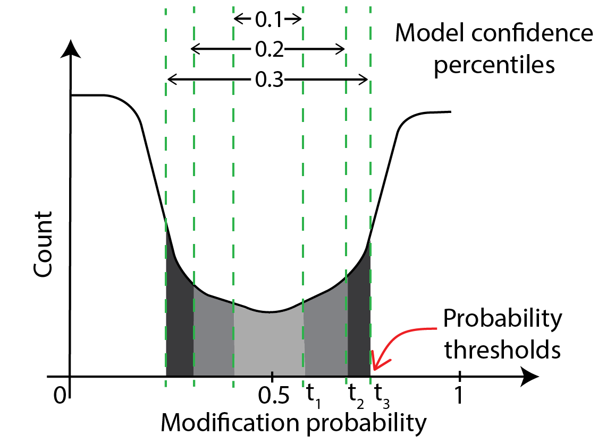

In this session, we will look at commands that manipulate modification 
data in mod BAM and produce summary statistics or plots.
Some of these commands are similar to those run behind the scenes
in a visualization software.
By running these commands ourselves, we get quantitative output
in a tabular format instead of an image format, and we can manipulate
this data further in our own scripts/pipelines.
These steps are all in the 'further analysis' section of our pipeline
and must be tuned or tailored to the experiment at hand by the experimenter.



The operations we will be running on mod BAM files are:
- thresholding
- making histograms of modification probabilities
- subsetting (either randomly, or by genomic location, or by mean modification density)
- windowing modification calls



We can achieve most of these operations using the pre-existing packages `modkit` and `samtools`.
For windowing and for measuring mean modification densities across reads,
we will use our own tools due to an absence of ready-made tools.
In a later [session]({{ site.baseurl }}/materials/single-molecule-visualization),
we will use the package `modbamtools` for further manipulation.

## Simple thresholding of mod BAM files with `modkit`

Thresholding is the process of converting soft modification calls to hard calls
i.e transforming a probability of modification per base per sequenced strand to a binary yes/no.
The ground truth for an experimental sample is that every base on a DNA strand
is either modified or unmodified.
The probability of modification associated with every base in a mod BAM file
is due to uncertainty in the measurement procedure and this accumulates from
different stages of our experiment and subsequent analysis,
all the way from sample preparation to modification calling on a computer.
For some applications, we just want a simple yes/no answer to the modification question
and this uncertainty is not important.

There are two ways of thresholding, and they can be applied separately or together: 
- thresholding directly on modification probabilities,
- thresholding on model confidences.

We will be using just thresholding directly on probabilities, and leave
thresholding on model confidences to optional sections below.

The probability curve of modification per base usually looks like the following image.
Each point on the curve corresponds to a probability of modification `p_mod` and
a probability that the base is unmodified `p_unmod`; these add up to 1.
The calls with probabilities close to zero or one are where the model in the modification
caller is certain that the call is correct. The calls around 0.5 are where
model uncertainty is the highest as it is doing no better than an unbiased coin toss.



To threshold directly on probabilities, we convert bases with the probability of
modification `p_mod` above a threshold value into modified and bases with `p_mod` below
that value into unmodified. The simplest threshold value is 0.5.
If one wanted to make an informed choice about a threshold, one has to generate the histogram,
examine it, and make a decision - we will cover this later in this session.



We can execute the thresholding step with a threshold of 0.5 using `modkit`.

```bash
input_mod_bam= # fill suitably
output_mod_bam= # fill suitably
modkit call-mods --no-filtering $input_mod_bam $output_mod_bam
```

Run `modkit extract` on the input and output mod bam files.
You will see that the modification probability is now either
a value very close to zero or a value very close to one.

### (optional) Multiple modifications

Please note that if there are multiple modifications, a base
can exist in more than two states: unmodified, modification of the first type,
modification of the second type etc. 
Now `call-mods` assigned the state with the highest measured probability to the base.

### Syntax for thresholds other than 50%

If we want to use a threshold other than 0.5, the syntax is 

```bash
input_mod_bam= # fill suitably
output_mod_bam= # fill suitably
mod_code= # fill with mod code. e.g.: T for our BrdU data, m for 5mC.
threshold= # fill with a number between 0 and 1.
modkit call-mods --mod-threshold $mod_code:$threshold \
  --filter-percentile 0 $input_mod_bam $output_mod_bam
```

### (optional) Using model confidences as thresholds

Another way to perform thresholding is through model confidences.
Model confidence is highest at bases with modification probabilities close
to zero or one. 
At these bases, the model is very confident that the base is unmodified
or modified respectively.
Model confidence is lowest at bases with modification probabilities close
to 0.5.
Here, the model is saying it can do no better than an unbiased coin toss.
A schematic of confidence percentiles on a modification-probability curve
is shown below.
As you can see, model confidences grow as one moves away from the midpoint
of 0.5 in either direction.
Model confidence is not a new measurement - we are just asking which parts
of the probability curve around the center have areas a fraction of the
whole curve with the fraction set at 10%, 20% etc. 



One can threshold using the percentiles of confidence as shown below.
In principle, we are moving high-confidence model calls to the modified
or unmodified category and discarding the low-confidence model calls.
This approach is similar to the simple thresholding we have discussed
thus far but we use two thresholds here and the probabilities corresponding to the
two thresholds is not known beforehand.



This thresholding is accomplished through the `--filter-percentile` and/or
the `--filter-threshold` options of `modkit call-mods`, which may be used standalone or
in addition to the `--mod-threshold` parameter.
We will not be discussing this further; you can refer to the modkit documentation
[here](https://nanoporetech.github.io/modkit/advanced_usage.html#call-mods) if you are interested.


## Histograms of modification probabilities using `modkit`

In this section, we will calculate histograms of per-base modification probabilities.
One of its uses is helping us choose a threshold for a thresholding step that we were
discussing above.
Another use is to see if our experiment worked and we are seeing an expected number
of bases with modifications.

We will use the `modkit sample-probs` command. 
We operate the tool in the histogram mode `--hist` and want ten
bins in the histogram (`--buckets 10`), and wish to sample
1000 reads (`-n 1000`) to measure statistics (we are using 1000
to save runtime; usually a fraction of the BAM file is sufficient
for these calculations and we leave it to the experimenter to
determine what that fraction is for their dataset).
We will discuss the `-p` option in an optional subsection a little later.

NOTE: The `modkit sample-probs` command produces tabular files
with rows labeled with either an unmodified one-letter code or
a modified one-letter code.
In the case of 5mC methylation which is coded
as `C+m`, the rows are labelled either `C` or `m`.
In the case of a generic modification such as `T+T`,
which we use to label our BrdU data,
we run into problems because both the modified and
the unmodified rows are labeled `T`.
This is a problem with the `modkit sample-probs` tool.
To get around the problem, before using this tool, we change
the `T+T` code to `T+B` using `modkit adjust-mods`.
This is not a good idea in general as `B` means not `A` in the
standard one-letter nucleotide code list.
But, as the modification field is still developing, we occasionally
run into these problems and have to use such workarounds.

```bash
input_mod_bam= # fill this suitably
input_mod_bam_adjust_tag= # fill this suitably

# convert mod BAM from using T+T to T+B
modkit adjust-mods --convert T B $input_mod_bam \
  $input_mod_bam_adjust_tag
samtools index $input_mod_bam_adjust_tag

# sample probabilities and make a histogram
cd ~/nanomod_course_outputs/yeast
modkit sample-probs -p 0.1,0.2,0.3,0.4,0.5 \
  $input_mod_bam_adjust_tag -o ./histogram --hist --buckets 10 -n 1000
```

The output files are deposited in the `./histogram` folder.
You should see three output files: `probabilities.txt`, `probabilities.tsv`
and `thresholds.tsv`.
The `probabilities` files report number of modified bases in ten buckets of
modification probability `p_mod` from 0.5 - 1.0,
and the same for the number of unmodified bases using the probability that
the base is not modified `p_unmod = 1 - p_mod`.
`probabilities.txt` also contains a histogram made with ASCII art
(i.e. using the symbol ∎ to build horizontal bars of this histogram).

Have a look at these files, and answer this question for yourself: what 
would be a good modification probability value for thresholding?

### (optional) thresholds.tsv: measure correspondence between model confidence thresholds and direct probability thresholds

`thresholds.tsv` contains the table of conversion between model confidences and direct probability thresholds.
This is illustrated in the schematic below, which shows that model confidences of 10% and below
lie between modification probabilities of `t_1` and `0.5 - t_1`, confidences of 20% and below lie between
`t_2` and `0.5-t_2` etc. So, thresholds.tsv contains a table that lists this correspondence.
There are a few other details such as how the program deals with probability curves that are not symmetric about 0.5.
We are not going to discuss this further; please experiment with this tool and read the 
[documentation](https://nanoporetech.github.io/modkit/advanced_usage.html#sample-probs) to learn more.



### Form modification histogram from data only at given genomic regions

To form a histogram from data restricted to given genomic regions, pass a BED file
containing these regions to `modkit sample-probs` with the `--include-bed`
option. In the command block below, we look for modification probabilities in
the regions `chrI:100000-200000` and `chrVII:500000-600000`. In other words,
the program calculates statistics from bases on reads that fall in either
region.

```bash
input_mod_bam= # fill this suitably
input_mod_bam_adjust_tag= # fill this suitably
regions_bed_file= # we are going to make this file

# convert mod BAM from using T+T to T+B
modkit adjust-mods --convert T B $input_mod_bam \
  $input_mod_bam_adjust_tag

# one can use any regions and any number of regions in the commands
# below. The '.' in the sixth column means we include both +
# and - strands in our calculation.
echo -e "chrI\t100000\t200000\tA\t1000\t." > $regions_bed_file;   
echo -e "chrVII\t500000\t600000\tB\t1000\t." >> $regions_bed_file;

# sample probabilities and make a histogram
cd ~/nanomod_course_outputs/yeast
modkit sample-probs -p 0.1,0.2,0.3,0.4,0.5 \
  $input_mod_bam_adjust_tag -o ./histogram_subset --hist --buckets 10 -n 1000 \
  --include-bed $regions_bed_file
```

## (optional) Use `modkit motif-bed` to form bed files for motifs

To form a BED file for particular motifs such as CG, you can use the `modkit motif-bed`
command.
Please refer to the modkit [documentation](https://nanoporetech.github.io/modkit/advanced_usage.html)
for more details.

## Subsetting mod BAM files with samtools

We take a mod BAM file as input and produce a subset mod BAM file
as output by accepting or rejecting each entire read based on some criterion.
We will discuss five types of subsetting in this section:
- subset by genomic region.
- subset by read id
- subset randomly
- subset by modification amount per read
- any combination of the above

Following are examples of where subsetting is useful.

- to get a quick look at the data
- to downsample a dataset before calculations for which a representative, small number of reads are sufficient.
- to enrich for reads with some features e.g. highly modified, located near a gene of interest etc.

Before we perform any subset, we first count the total number of reads we have
in a mod BAM file.

### (optional) Count number of reads

```bash
input_mod_bam= # fill with whatever input file you want to use
samtools view -c $input_mod_bam
```

### (optional) Subset by region

The following command makes a mod BAM file with only reads that pass through a given region.
Note that the subset will pick out entire reads,
not just the part of the read that overlaps with the region. 

```bash
contig= # fill with a suitable contig e.g. chrII
start= # fill with a suitable start coordinate e.g 80000
end= # fill with a suitable end coordinate e.g. 90000
input_mod_bam= # fill with whatever input mod BAM file you want to use
output_mod_bam= # fill with an output file name
samtools view -b -o $output_mod_bam $input_mod_bam $contig:$start-$end # perform subset
```

Let's do a quick check that our subset worked by counting the number of reads
and by examining their coordinates.

```bash
samtools view -c $input_mod_bam      # count reads of input file
samtools view -c $output_mod_bam     # count reads of output file
bedtools bamtobed -i $output_mod_bam | shuf | head -n 10 
    # look at a few output coordinates using bedtools bamtobed
    # to verify the reads overlap the region of interest.
    # you can run the bedtools command without the shuf and the head
    # if the $output_mod_bam is only a few lines long.
```

One can also subset by a list of regions; please follow the instructions in the `samtools view`
[documentation](http://www.htslib.org/doc/samtools-view.html) if you are interested.

### (optional) Subset by read id

The following command makes a mod BAM file with only the read of the read id of interest.

```bash
# fill the following values. 
# use any suitable mod BAM file and some read id of interest
# you have recorded.
input_mod_bam=
read_id=
output_mod_bam=
samtools view -b -e 'qname=="'$read_id'"' -o $output_mod_bam \
  $input_mod_bam # perform subset
samtools view -c $output_mod_bam # count reads
```

One can subset by a list of reads using the `-N` option.
Please look at the `samtools view` documentation [here](http://www.htslib.org/doc/samtools-view.html).

### (optional) Subset randomly

The following command makes a mod BAM file with a subset of randomly-chosen reads
whose total number is set by the input fraction and
the total number of reads in the input file.
Please note that this command does not work very well if the number of reads
in the input file is very low (~ 1 - 100).

```bash
# fill the following values suitably. 
# use any suitable mod BAM file
input_mod_bam=
output_mod_bam=
fraction=0.05
samtools view -s $fraction -b -o $output_mod_bam \
  $input_mod_bam # perform subset
samtools view -c $output_mod_bam # count reads
```

### Subset by modification amount

An experimenter may wish to isolate the reads with a minimum number of modified bases
in them for further analysis.
Unfortunately, there is no off-the-shelf `samtools` command or otherwise to achieve this.
We solve this problem using a custom script to generate mod BAM files with custom tags
at the end of each line with modification counts.
Then, samtools can be used to query this new mod BAM file to output the desired
high-modification-count subset.

We have implemented a custom script `count_mods_per_read.awk`
written for the tool `awk` that takes a thresholded mod BAM file as input
and makes an output file by appending a numeric tag `XC` at the end of each line.
The tag contains the number of modifications in that mod BAM line.
For example, the mod BAM line with the modification data `MM:Z:T+T?,0,0,0; ML:B:C,0,255,255`
gets the tag `XC:i:2` as there are two modifications.

The script is purely for demonstrative purposes and is not production-ready
as it will not work with all types of mod BAM files e.g. non-thresholded ones,
ones with multiple modifications, and a few others.
We wanted a simple demonstration of how to leverage pre-existing tools and our knowledge
of the mod BAM format to write tools ourselves when they are not available.
So we have not added all the additional features to make the script a
good production script for the sake of simplicity.

```bash
cd ~/nanomod_course_scripts/nanopore-mod-course/code
input_bam= # fill suitably with a thresholded modBAM file,
           # or threshold one first with `modkit call-mods` as we've
           # discussed earlier in this session and use it here
bam_with_counts= # fill suitably
samtools view -h $input_bam | awk -f count_mods_per_read.awk |\
  samtools view -b -o $bam_with_counts
# above line converts BAM -> SAM, runs script on it,
# and converts back to BAM.
# the output bam file contains the XC tag.
```

Let us display a table of some reads, their alignment coordinates,
and their modification
counts using the following `bedtools bamtobed` command.
The output data is in the BED format, with the fifth column
containing the modification count from the XC tag (`-tag XC`).

```bash
bedtools bamtobed -i $bam_with_counts -tag XC | shuf | head -n 20
# you can drop the shuf and the head if the bam file is short enough
```

The advantage of storing modification counts using a tag in
the modBAM file is that one can use `samtools` to achieve
the desired high-modification-count subset now.
The following command extracts reads with at least 100 modified bases
per read.

```bash
output_bam= # fill suitably
samtools view -e '[XC]>100' -b -o $output_bam $bam_with_counts
```

One can combine other variables like alignment length with our modification
count in samtools queries.
We give an example below where we form a subset of reads with at least
one modified base per 100 aligned bases on average.

```bash
output_bam= # fill suitably
samtools view -e '[XC]/rlen>0.01' -b -o $output_bam $bam_with_counts
```

#### (optional) More details about the modification counting script

We have written the script in the AWK programming language.
The logic in the script is to read each line, isolate the column starting with ML,
split by comma, count the number of 255s in it, put this information
in an XC tag, and append it to the line.
This logic could easily be implemented in python or R as well.
We have chosen a tag starting with 'X' so as to not to interfere with other
BAM tags.

### Combining several filters to form subsets with `samtools`

A powerful feature of `samtools` is that any of the commands we have used above
can be combined to form complex queries that would have otherwise required
a substantial amount of computer code to achieve.
For example: to get reads longer than 10 kb with more than 100 modifications, do
`samtools view -e '[XC]>100&&rlen>10000'`.
Please read the documentation on `samtools view`
[here](https://www.htslib.org/doc/samtools-view.html) and the documentation
on filter expressions [here](https://www.htslib.org/doc/1.19/samtools.html#FILTER_EXPRESSIONS)
to learn about the possibilities.

## Combining mod BAM tools leads to easy workflows

It is important to remember that any tool that takes a mod BAM file
as an input can also take a subset mod BAM file as input.
One can easily write sophisticated scripts combining tools
such as `modkit` and `samtools` to achieve some tasks 
without going through the hassle of processing a raw mod BAM file
using a programming language.

## Exercise

We will use what we have learned thus far in this session to identify a
highly-modified region in our subset mod BAM file
`~/nanomod_course_data/yeast/subset_2.sorted.bam` in
[this]({{ site.baseurl }}/exercises/most_modified_region) exercise.

## (optional) Windowing mod BAM files using custom scripts

We will now learn how to make the data behind the windowed track that we saw in
our earlier visualization [session]({{ site.baseurl }}/materials/genome-browser-visualization)
when we made one-read modification plots.
We will measure mean modification density per shoulder-to-shoulder windows of a given
size in base pairs along a read and output it to a tab-separated file.
We will use two custom python scripts that we have written as there are no
ready-made tools for this purpose.

```bash
one_read_bam= # fill suitably with a mod BAM file with
              # just one read in it

# Extract modification information from the bam file
# NOTE: the --force overwrites any pre-existing output files.
modkit extract --force "$one_read_bam" "$one_read_bam".tsv

# Use python scripts to extract raw data and window it
mod_code=                  # use m for 5mC or T for BrdU etc.
ref_flag=use_ref        # window using reference coordinates
threshold=                 # threshold to call bases as modified
window_size= # size of window in number of bases of interest
             # e.g. 300

python extract_raw_mod_data.py $mod_code $ref_flag\
  "$one_read_bam".tsv "$one_read_bam"_rawVal.tsv
python window_mod_data.py $threshold $window_size \
  "$one_read_bam"_rawVal.tsv "$one_read_bam"_winVal.tsv
```

Please see the windowed data in the `"$one_read_bam"_winVal.tsv` file.

## Final remarks

We have learned how to perform the following operations on mod BAM files:
- thresholding
- making histograms of modification probabilities
- subsetting
- windowing modification calls

Most of these operations could be performed using pre-existing tools and
can be incorporated easily into scripts.
Occasionally, we ran into operations that could not be performed with
pre-existing tools and had to write one ourselves.
The tools we have learned here can be applied to any experiment
where we detect DNA modifications if the output format of the modification
pipeline is mod BAM.