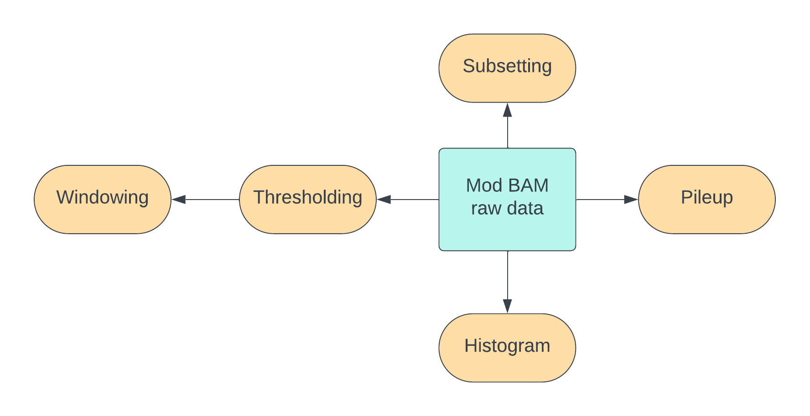

<!--
types of manipulation: thresholding, windowing, subsetting, pileup.
subset can be randomly, by genomic location, by mean density
modQC: how many modified, unmodified, no standard package so we'll have to do the tools ourselves.
three choices - our own program, samtools or modkit.
-->

In this session, we will look at commands that manipulate modification 
data in mod BAM and produce summary statistics or plots.
Some of these commands are similar to those run behind the scenes
in a visualization software.
By running these commands ourselves, we get quantitative output
in a tabular format instead of an image format, and we can manipulate
this data further in our own scripts/pipelines.



## Refresher: Examine mod BAM files with modkit extract

As we have seen in a previous [session]({{ site.baseurl }}/materials/mod-bam-format),
the raw mod BAM format is pretty hard to parse for a person.
It is much more convenient to convert mod BAM files into a tabular format using
the `modkit extract` command.

```bash
input_bam_file= # fill with a suitable file
modkit extract $input_bam_file -
# - means the output goes to the standard output i.e. the screen.
# if your file is too large, pipe output through shuf and head.
# e.g. modkit extract $input_bam_file - | shuf | head -n 20
```

Please pay close attention to the first, second, third, fourth, and eleventh columns
which contain data corresponding to the read id, position along the read,
position along the reference, contig on the reference, and modification probability.

## Simple thresholding of mod BAM files with modkit

In reality, a base on a DNA strand can be either modified or unmodified.
So, the probability of modification associated with every base in a mod BAM file
is due to uncertainty in the measurement procedure.
A thresholding step converts these soft modification calls into hard binary calls
(modified/unmodified) using a numeric threshold on the probability.
The simplest threshold is 50%.
We can execute the thresholding step using `modkit`.

```bash
input_mod_bam= # fill suitably
output_mod_bam= # fill suitably
modkit call-mods --no-filtering $input_mod_bam $output_mod_bam
```

Run `modkit extract` on the input and output mod bam files.
You will see that the modification probability is now either
a value very close to zero 1/(2\*256) or a value very close to
one 1 - 1/(2\*256).

(optional) Please note that if there are multiple modifications,
`--no-filtering` calls each base as unmodified or modified with a
particular modification depending on which of these cases is assigned
the highest probability.

<!-- TODO: work this in 
modkit call-mods --mod-threshold m:0.92 --filter-percentile 0\
  PAM63103_0cd67e80_10000.only_10_reads.5mCG.bam test.2.bam
-->

## Subsetting mod BAM files with samtools

The first operation we will look at is subsetting the mod BAM file.
Whenever you zoom in to a region or click on a read in IGV, you are basically
subsetting a mod BAM file by region or by read id.
We will also discuss random subsetting which comes in handy when a BAM file
is very large and we are interested in a calculation whose result depends
very weakly on the number of reads, so it is sufficient to run the calculation
on a randomly-selected subset of reads.

Before we perform any subset, we first count the total number of reads we have
in a mod BAM file.

Count number of reads
```bash
input_file= # fill with whatever input file you want to use
samtools view -c $input_file
```

Subset by region:
Note that the subset will pick out entire reads that pass through a given region,
not just the part of the read corresponding to the region.
```bash
contig=chrII
start=80000
end=90000
input_file= # fill with whatever input file you want to use
output_file= # fill with an output file name
samtools view -b -o $output_file $input_file $contig:$start-$end # perform subset
```

Let's do a quick check that our subset worked by counting the number of reads
and by examining their coordinates.

```bash
samtools view -c $input_file      # count reads of input file
samtools view -c $output_file     # count reads of output file
bedtools bamtobed -i $output_file | shuf | head -n 10 
    # look at a few output coordinates
    # you can run the bedtools command without the shuf and the head if
    # the output__file is only a few lines long.
```

Subset by read id:
```bash
# fill the following values. 
# use any suitable mod BAM file and some read id of interest you have recorded.
input_file=
read_id=
output_file=
samtools view -b -e 'qname=="'$read_id'"' -o $output_file $input_file # perform subset
samtools view -c $output_file # count reads
```

Get a random subset:
```bash
# fill the following values suitably. 
# use any suitable mod BAM file
input_file=
output_file=
fraction=0.05
samtools view -s $fraction -b -o $output_file $input_file # perform subset
samtools view -c $output_file # count reads
```

### Ways to perform pileup with samtools

<!-- TODO: flesh this out more -->

Get coverage
`samtools coverage dnascent.detect.mod.sorted.bam`

Get modification
`samtools mpileup -M dnascent.detect.mod.sorted.bam`

### Pileup with modkit

<!-- TODO: flesh this out more -->
<!-- TODO: do we need --no-filtering? -->
`modkit pileup --no-filtering --mod-thresholds T:0.03 dnascent.detect.mod.sorted.bam test.08jan24.bed`


<!--
introduce thresholding and windowing but need not get into details here.
-->

<!-- TODO -->
```bash
./sample.test.awk sample.test.sam | samtools view -b | bedtools bamtobed -i - -tag XC
```
<!-- after making mod counts, can use commands like these  -->
```bash
samtools view -e '[XC]/qlen>0.02' -b -o testo.bam sample.bam
```

<!-- TODO: can introduce modbedtools https://github.com/lidaof/modbedtools 
https://doi.org/10.1016/j.xgen.2023.100455 -->

<!-- TODO: 
modkit sample-probs -n 1000 --out-dir ./test --hist --buckets 20 gm12878_ul_sup_megalodon_HP_chr20.bam
-->