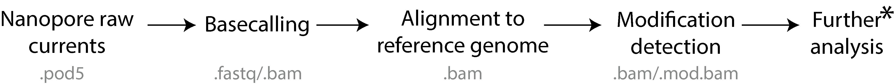
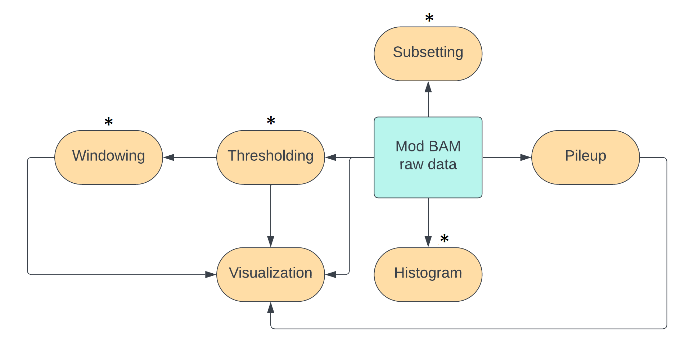
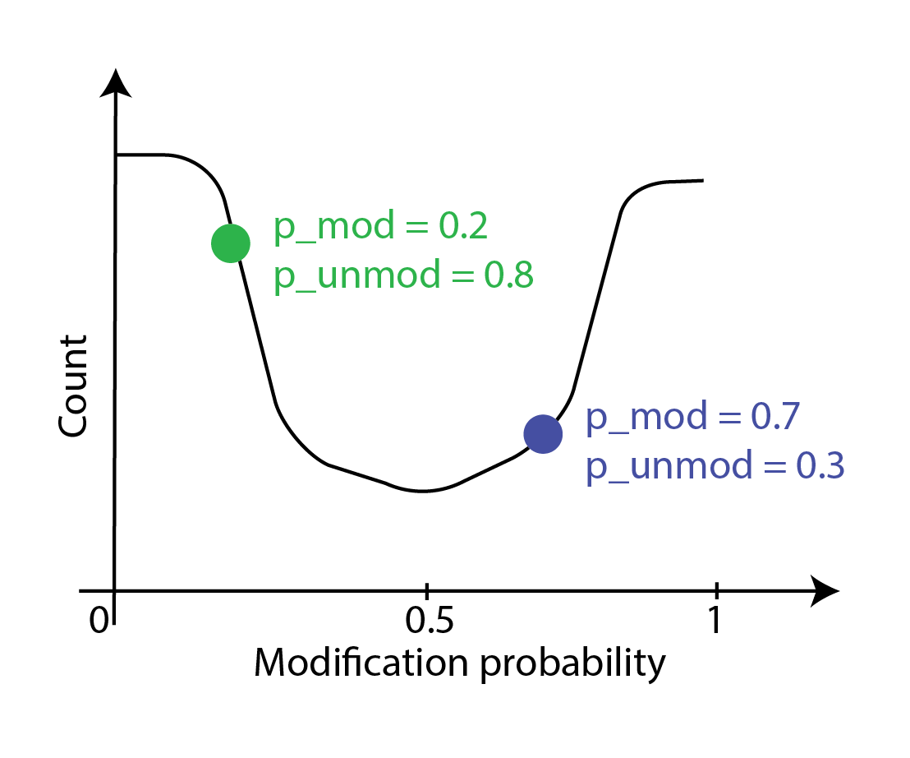
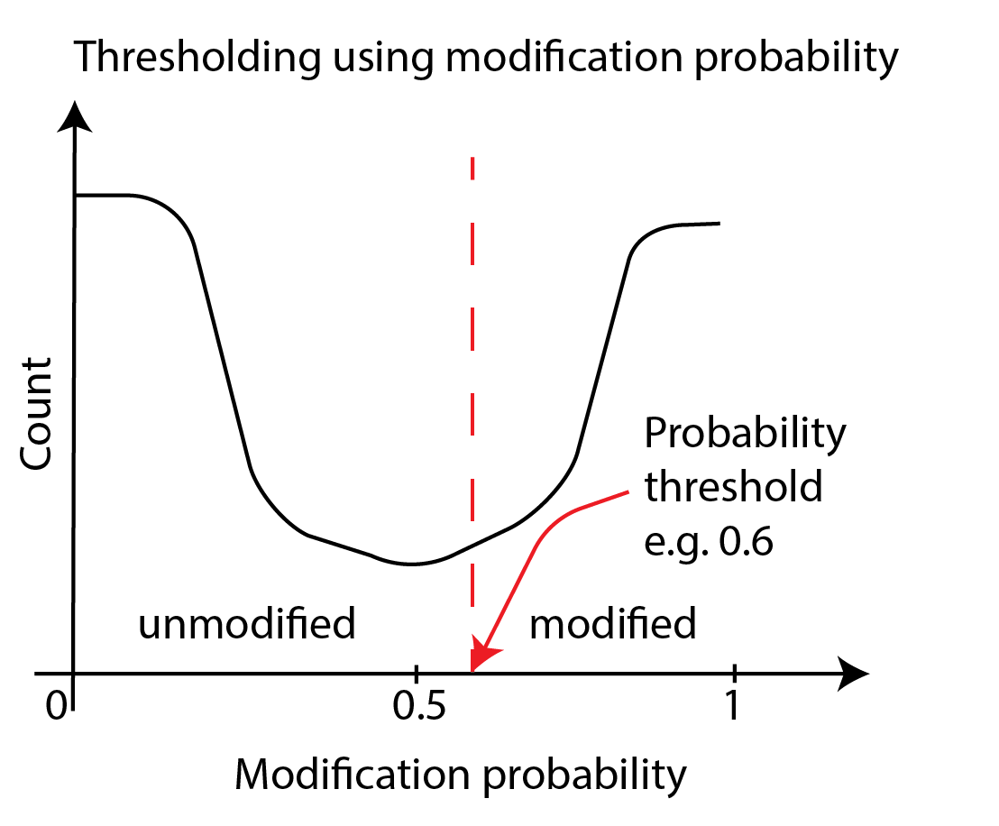
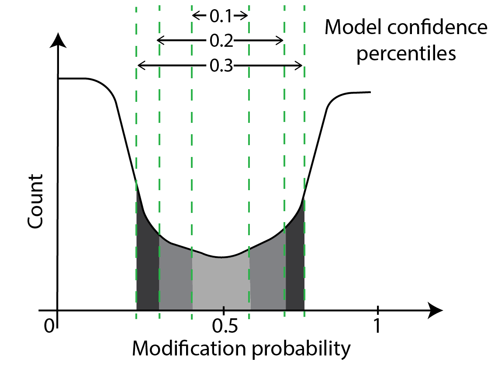
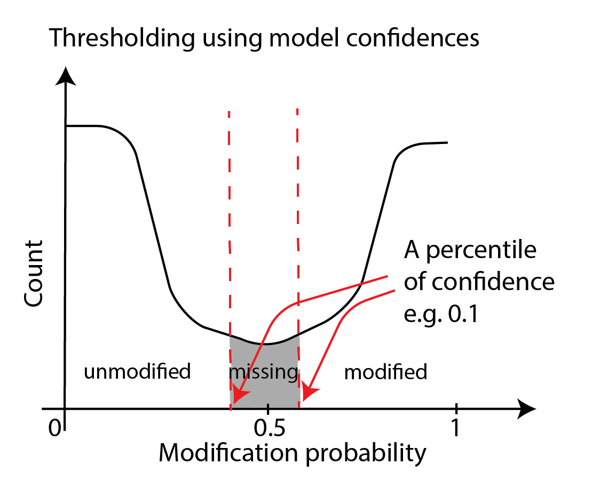
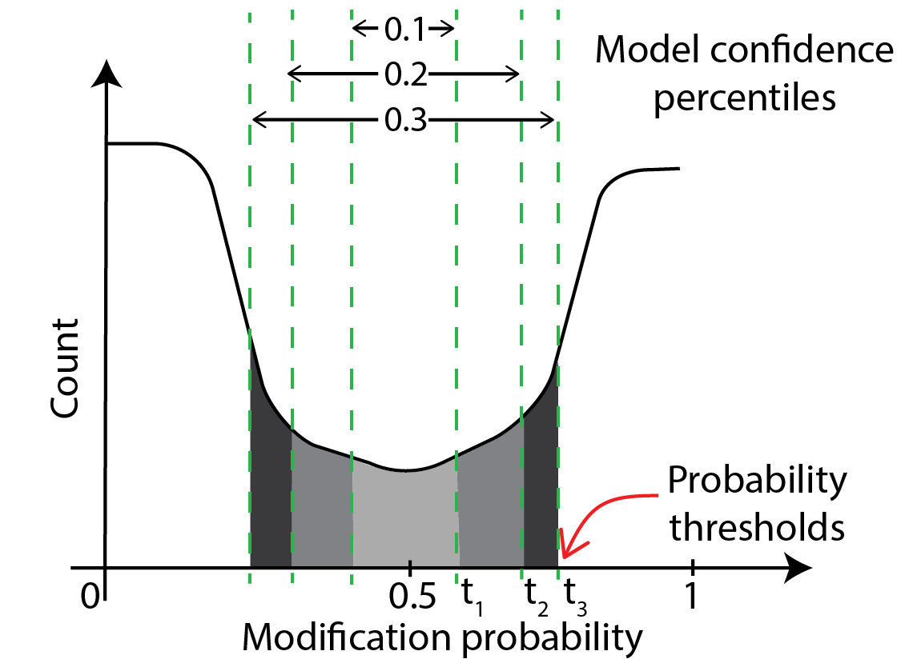

In this session, we will look at commands that manipulate modification 
data in mod BAM and produce summary statistics or plots.
Some of these commands are similar to those run behind the scenes
in a visualization software.
By running these commands ourselves, we get quantitative output
in a tabular format instead of an image format, and we can manipulate
this data further in our own scripts/pipelines.
These steps are all in the 'further analysis' section of our pipeline
and must be tuned or tailored to the experiment at hand by the experimenter.



The operations we will be running on mod BAM files are:
- thresholding
- making histograms of modification probabilities
- subsetting (either randomly, or by genomic location, or by mean modification density)
- windowing modification calls

We will cover some of these in the main lesson.
Those interested can learn the others in the optional sections.



We can achieve most of these operations using the pre-existing packages `modkit` and `samtools`.
For windowing and for measuring mean modification densities across reads,
we will use our own tools due to an absence of ready-made tools.
In a later [session]({{ site.baseurl }}/materials/single-molecule-visualization),
we will use the package `modbamtools` for further manipulation.

## Simple thresholding of mod BAM files with `modkit`

Thresholding is the process of converting soft modification calls to hard calls
i.e transforming a probability of modification per base per sequenced strand to a binary yes/no.
The ground truth for an experimental sample is that every base on a DNA strand
is either modified or unmodified.
The probability of modification associated with every base in a mod BAM file
is due to uncertainty in the measurement procedure and this accumulates from
different stages of our experiment and subsequent analysis,
all the way from sample preparation to modification calling on a computer.
For some applications, we just want a simple yes/no answer to the modification question
and this uncertainty is not important.

There are two ways of thresholding, and they can be applied separately or together: 
- thresholding directly on modification probabilities,
- thresholding on model confidences.

We will be using just thresholding directly on probabilities, and leave
thresholding on model confidences to optional sections below.

The probability curve of modification per base usually looks like the following image.
Each point on the curve corresponds to a probability of modification `p_mod` and
a probability that the base is unmodified `p_unmod`; these add up to 1.
The calls with probabilities close to zero or one are where the model in the modification
caller is certain that the call is correct. The calls around 0.5 are where
model uncertainty is the highest as it is doing no better than an unbiased coin toss.



To threshold directly on probabilities, we convert bases with the probability of
modification `p_mod` above a threshold value into modified and bases with `p_mod` below
that value into unmodified. The simplest threshold value is 0.5.
If one wanted to make an informed choice about a threshold, one has to generate the histogram,
examine it, and make a decision - we will cover this later in this session.



We can execute the thresholding step with a threshold of 0.5 using `modkit`.

```bash
input_mod_bam=~/nanomod_course_outputs/yeast/dnascent.mod.sorted.bam
output_mod_bam=~/nanomod_course_outputs/yeast/dnascent.detect.mod.thresholded.bam
modkit modbam call-mods --no-filtering $input_mod_bam $output_mod_bam
```

Run `modkit extract full` on the input and output mod bam files.
You will see that the modification probability is now either
a value very close to zero or a value very close to one.

<details markdown="1">

<summary markdown="span"> 

Optional: multiple modifications

</summary>

### Multiple modifications

Please note that if there are multiple modifications, a base
can exist in more than two states: unmodified, modification of the first type,
modification of the second type etc. 
Now `call-mods` assigned the state with the highest measured probability to the base.

</details>

<details markdown="1">

<summary markdown="span"> 

Optional: syntax for thresholds other than 50%

</summary>

### Syntax for thresholds other than 50%

If we want to use a threshold other than 0.5, the syntax is 

```bash
input_mod_bam= # fill suitably
output_mod_bam= # fill suitably
mod_code= # fill with mod code. e.g.: T for our BrdU data, m for 5mC.
threshold= # fill with a number between 0 and 1.
modkit modbam call-mods --mod-threshold $mod_code:$threshold \
  --filter-percentile 0 $input_mod_bam $output_mod_bam
```

</details>

<details markdown="1">

<summary markdown="span"> 

Optional: using model confidences as thresholds

</summary>

### Using model confidences as thresholds

Another way to perform thresholding is through model confidences.
Model confidence is highest at bases with modification probabilities close
to zero or one. 
At these bases, the model is very confident that the base is unmodified
or modified respectively.
Model confidence is lowest at bases with modification probabilities close
to 0.5.
Here, the model is saying it can do no better than an unbiased coin toss.
A schematic of confidence percentiles on a modification-probability curve
is shown below.
As you can see, model confidences grow as one moves away from the midpoint
of 0.5 in either direction.
Model confidence is not a new measurement - we are just asking which parts
of the probability curve around the center have areas a fraction of the
whole curve with the fraction set at 10%, 20% etc. 



One can threshold using the percentiles of confidence as shown below.
In principle, we are moving high-confidence model calls to the modified
or unmodified category and discarding the low-confidence model calls.
This approach is similar to the simple thresholding we have discussed
thus far but we use two thresholds here and the probabilities corresponding to the
two thresholds is not known beforehand.



This thresholding is accomplished through the `--filter-percentile` and/or
the `--filter-threshold` options of `modkit modbam call-mods`, which may be used standalone or
in addition to the `--mod-threshold` parameter.
We will not be discussing this further; you can refer to the modkit documentation
[here](https://nanoporetech.github.io/modkit/advanced_usage.html#call-mods) if you are interested.

</details>

<details markdown="1">

<summary markdown="span"> 

Optional: constructing histograms of modification probabilities

</summary>

## Histograms of modification probabilities using `modkit`

In this section, we will calculate histograms of per-base modification probabilities.
One of its uses is helping us choose a threshold for a thresholding step that we were
discussing above.
Another use is to see if our experiment worked and we are seeing an expected number
of bases with modifications.

We will use the `modkit modbam sample-probs` command. 
We operate the tool in the histogram mode `--hist`
and wish to sample
1000 reads (`-n 1000`) to measure statistics (we are using 1000
to save runtime; usually a fraction of the BAM file is sufficient
for these calculations and we leave it to the experimenter to
determine what that fraction is for their dataset).
We will discuss the `-p` option in an optional subsection a little later.

```bash
input_mod_bam= # fill this suitably

# sample probabilities and make a histogram
cd ~/nanomod_course_outputs/yeast
modkit modbam sample-probs -p 0.1,0.2,0.3,0.4,0.5 \
  $input_mod_bam -o ./histogram --hist -n 1000
```

The output files are deposited in the `./histogram` folder.
You should see some text output files and some HTML files with plots.
Have a look at these files, and answer this question for yourself: what 
would be a good modification probability value for thresholding?

### thresholds.tsv: measure correspondence between model confidence thresholds and direct probability thresholds

`thresholds.tsv` contains the table of conversion between model confidences and direct probability thresholds.
This is illustrated in the schematic below, which shows that model confidences of 10% and below
lie between modification probabilities of `t_1` and `0.5 - t_1`, confidences of 20% and below lie between
`t_2` and `0.5-t_2` etc. So, thresholds.tsv contains a table that lists this correspondence.
There are a few other details such as how the program deals with probability curves that are not symmetric about 0.5.
We are not going to discuss this further; please experiment with this tool and read the 
[documentation](https://nanoporetech.github.io/modkit/advanced_usage.html#sample-probs) to learn more.



### Form modification histogram from data only at given genomic regions

To form a histogram from data restricted to given genomic regions, pass a BED file
containing these regions to `modkit modbam sample-probs` with the `--include-bed`
option. In the command block below, we look for modification probabilities in
the regions `chrI:100000-200000` and `chrVII:500000-600000`. In other words,
the program calculates statistics from bases on reads that fall in either
region.

```bash
input_mod_bam= # fill this suitably
regions_bed_file= # we are going to make this file

# one can use any regions and any number of regions in the commands
# below. The '.' in the sixth column means we include both +
# and - strands in our calculation.
echo -e "chrI\t0\t230000\tA\t1000\t." > $regions_bed_file;   
echo -e "chrVII\t0\t800000\tB\t1000\t." >> $regions_bed_file;

# sample probabilities and make a histogram
cd ~/nanomod_course_outputs/yeast
modkit modbam sample-probs -p 0.1,0.2,0.3,0.4,0.5 \
  $input_mod_bam -o ./histogram_subset --hist -n 1000 \
  --include-bed $regions_bed_file
```

## Use `modkit motif` to form bed files for motifs

To form a BED file for particular motifs such as CG, you can use the `modkit motif`
command.
Please refer to the modkit [documentation](https://nanoporetech.github.io/modkit/advanced_usage.html)
for more details.

</details>

## Subsetting mod BAM files with samtools

We take a mod BAM file as input and produce a subset mod BAM file
as output by accepting or rejecting each entire read based on some criterion.
We will discuss five types of subsetting in this section:
- subset by genomic region.
- subset by read id
- subset randomly
- subset by modification amount per read
- any combination of the above

Following are examples of where subsetting is useful.

- to get a quick look at the data
- to downsample a dataset before calculations for which a representative, small number of reads are sufficient.
- to enrich for reads with some features e.g. highly modified, located near a gene of interest etc.

Before we perform any subset, we first count the total number of reads we have
in a mod BAM file.

### Count number of reads

```bash
input_mod_bam=~/nanomod_course_outputs/yeast/dnascent.detect.mod.thresholded.bam
samtools view -c $input_mod_bam
```

<details markdown="1">

<summary markdown="span"> 

Optional: subset by genomic region, read id, or in a random manner

</summary>

### Subset by region

The following command makes a mod BAM file with only reads that pass through a given region.
Note that the subset will pick out entire reads,
not just the part of the read that overlaps with the region. 

```bash
contig= # fill with a suitable contig e.g. chrII
start= # fill with a suitable start coordinate e.g 80000
end= # fill with a suitable end coordinate e.g. 90000
input_mod_bam= # fill with whatever input mod BAM file you want to use
output_mod_bam= # fill with an output file name
samtools view -b -o $output_mod_bam $input_mod_bam $contig:$start-$end # perform subset
```

Let's do a quick check that our subset worked by counting the number of reads
and by examining their coordinates.

```bash
samtools view -c $input_mod_bam      # count reads of input file
samtools view -c $output_mod_bam     # count reads of output file
bedtools bamtobed -i $output_mod_bam | shuf | head -n 10 
    # look at a few output coordinates using bedtools bamtobed
    # to verify the reads overlap the region of interest.
    # you can run the bedtools command without the shuf and the head
    # if the $output_mod_bam is only a few lines long.
```

One can also subset by a list of regions; please follow the instructions in the `samtools view`
[documentation](http://www.htslib.org/doc/samtools-view.html) if you are interested.

### Subset by read id

The following command makes a mod BAM file with only the read of the read id of interest.

```bash
# fill the following values. 
# use any suitable mod BAM file and some read id of interest
# you have recorded.
input_mod_bam=
read_id=
output_mod_bam=
samtools view -b -e 'qname=="'$read_id'"' -o $output_mod_bam \
  $input_mod_bam # perform subset
samtools view -c $output_mod_bam # count reads
```

One can subset by a list of reads using the `-N` option.
Please look at the `samtools view` documentation [here](http://www.htslib.org/doc/samtools-view.html).

### Subset randomly

The following command makes a mod BAM file with a subset of randomly-chosen reads
whose total number is set by the input fraction and
the total number of reads in the input file.
Please note that this command does not work very well if the number of reads
in the input file is very low (~ 1 - 100).

```bash
# fill the following values suitably. 
# use any suitable mod BAM file
input_mod_bam=
output_mod_bam=
fraction=0.05
samtools view -s $fraction -b -o $output_mod_bam \
  $input_mod_bam # perform subset
samtools view -c $output_mod_bam # count reads
```

</details>

### Subset by modification amount

An experimenter may wish to isolate the reads with a minimum number of modified bases
in them for further analysis. The following command outputs counts of modification
per read.

```bash
input_mod_bam=~/nanomod_course_outputs/yeast/dnascent.mod.sorted.bam
nanalogue read-info $input_mod_bam
```

You can choose read ids with a high number of modifications by querying the output of
these commands. You can use tools like `jq` to do this. A sample command is shown below.
You do not need to learn the language of `jq` -- tools like ChatGPT can help you write
these types of commands given the output structure of tools like `nanalogue` as an example.

```bash
input_mod_bam=~/nanomod_course_outputs/yeast/dnascent.mod.sorted.bam
nanalogue read-info --tag b $input_mod_bam |\
  jq -r '.[] | {read_id: .read_id, 
                mod_count: (.mod_count | split(":")[1] | split(";")[0] | tonumber )}' 
```

A further modification of the command above can report reads with a high enough mod count.
Here, we select only those reads with at least ten modification calls.
Again, tools like ChatGPT can help you write these commands; they just need to know the output
format of `nanalogue` and to be prompted to use the tool `jq`.

```bash
input_mod_bam=~/nanomod_course_outputs/yeast/dnascent.mod.sorted.bam
nanalogue read-info --tag b $input_mod_bam |\
  jq -r '.[] | {read_id: .read_id, 
                mod_count: (.mod_count | split(":")[1] | split(";")[0] | tonumber )}
             | select(.mod_count > 10)'
```

You can then use samtools to subset the mod bam file to just retain the reads of interest.
We first have to form a one-column text file containing just the read ids of interest.
Then, we use samtools to perform the subset.

```bash
input_mod_bam=~/nanomod_course_outputs/yeast/dnascent.mod.sorted.bam
output_mod_bam=~/nanomod_course_outputs/yeast/dnascent.highly_mod.sorted.bam
read_id_list=~/nanomod_course_outputs/yeast/highly_mod_reads
nanalogue read-info --tag b $input_mod_bam |\
  jq -r '.[] | {read_id: .read_id, 
                mod_count: (.mod_count | split(":")[1] | split(";")[0] | tonumber )}
             | select(.mod_count > 10) | .read_id' > $read_id_list
samtools view -b -N $read_id_list $input_mod_bam | samtools sort -o $output_mod_bam
samtools index $output_mod_bam
```

### Combining several filters to form subsets

A powerful feature of the BAM ecosystem (`samtools`, `modkit`, `nanalogue` etc.)
is that commands can be combined to form complex queries that would have otherwise required
a substantial amount of computer code to achieve.
Please read the documentation on `samtools view`
[here](https://www.htslib.org/doc/samtools-view.html), the documentation
on filter expressions [here](https://www.htslib.org/doc/1.19/samtools.html#FILTER_EXPRESSIONS),
and the documentation of the respective tools ([modkit](https://nanoporetech.github.io/modkit/) and
[nanalogue](https://nanalogue.com/all_cli_commands.html))
to learn about the possibilities. One feature that is useful is using `samtools` to perform
subsets and then passing this output to tools like `nanalogue` e.g.
`samtools view -b -h $input_mod_bam | nanalogue ...`

## Combining mod BAM tools leads to easy workflows

It is important to remember that any tool that takes a mod BAM file
as an input can also take a subset mod BAM file as input.
One can easily write sophisticated scripts combining tools
such as `modkit` and `samtools` to achieve some tasks 
without going through the hassle of processing a raw mod BAM file
using a programming language.

<details markdown="1">

<summary markdown="span"> 

Optional exercise

</summary>

## Exercise

We will use what we have learned thus far in this session to identify a
highly-modified region in our subset mod BAM file
`~/nanomod_course_data/yeast/subset_2.sorted.bam` in
[this]({{ site.baseurl }}/exercises/most_modified_region) exercise.

</details>

<details markdown="1">

<summary markdown="span"> 

Optional: windowing mod BAM files

</summary>

## Windowing mod BAM files

We will explore how to make the data behind the windowed track that we saw in
our earlier visualization [session]({{ site.baseurl }}/materials/genome-browser-visualization)
when we made one-read modification plots.
We will measure mean modification density per shoulder-to-shoulder windows of a given
size in base pairs along a read and output it to a tab-separated file.

```bash
mod_bam=~/nanomod_course_outputs/yeast/dnascent.mod.sorted.bam
windowed_data=~/nanomod_course_outputs/yeast/windowed_data_2
nanalogue window-dens --win 300 \
  --step 300 --tag b $mod_bam > $windowed_data

# inspect the produced file with this command
more $windowed_data
```

</details>

## Final remarks

We have learned how to perform the following operations on mod BAM files:
- thresholding
- making histograms of modification probabilities
- subsetting
- windowing modification calls

We covered some of these in the main lesson and some in the optional sections.

Most of these operations could be performed using pre-existing tools and
can be incorporated easily into scripts.
Occasionally, we ran into operations that could not be performed with
pre-existing tools and had to write one ourselves.
The tools we have learned here can be applied to any experiment
where we detect DNA modifications if the output format of the modification
pipeline is mod BAM.
