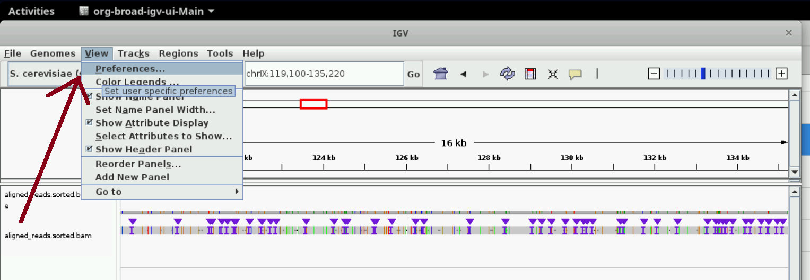
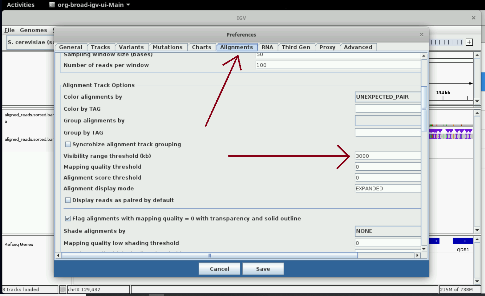

The hands-on sessions begin on our timeline from here.
Ensure that you have set your computer up using this [link]({{ site.baseurl }}/computer-setup)
and have the input data using this [link]({{ site.baseurl }}/data) before proceeding.

In this session, we will convert raw currents per DNA strand recorded by nanopore devices
into DNA sequences (basecalling), find the best-fit location for each strand on a
reference genome (alignment/genome mapping), and assess their quality (quality control).
Basecalling and quality control are the first steps in any nanopore experiment,
and are followed by more specialized steps like genome assembly or modification calling.

We will use a dataset of nanopore currents from [this](https://doi.org/10.1038/s41592-019-0394-y) study
of DNA replication dynamics in budding yeast as input. Genetically-modified cells consumed
5-bromodeoxyuridine (BrdU) added to the medium and this allowed substitution of thymidines
in newly synthesized DNA by BrdU. We are going to sequence the DNA and call modifications
on it over the next few sessions as described by the genomics pipeline image below.
We will perform the steps highlighted with an asterisk in this session.


## Basecalling: converting nanopore currents into DNA sequences

Nanopore devices ship with basecalling software that converts nanopore currents into DNA
sequences. Basecallers use pre-recorded model parameters that contain information about the
characteristic currents produced by different DNA k-mers as they translocate through the nanopore.
These programs segment the current corresponding to one DNA strand, assign a k-mer per segment,
and stitch k-mers together into one sequence. We will use two basecallers: `guppy` in this session
and the more-recent `dorado` in a [later]({{ site.baseurl }}/materials/compare-modification-detection)
session. The workflow is similar in either case and whether you are using R9 or R10 flowcells for sequencing.

Basecallers can be run on the nanopore device during sequencing and/or can be run later on a computer.
For most purposes, on-device basecalling is sufficient. If a higher accuracy is desired or
better model parameters become available, then data can be re-basecalled on a computer.
Accuracy is specified through input parameters and higher accuracy leads to longer runtimes.

Basecallers generally output DNA sequences with the four canonical DNA bases;
modification calling is a separate step and is bolted on to the output of basecallers.
We will deal with modification calling in a [later]({{ site.baseurl }}/materials/base-mod-detection)
session.

In this section, we will first look at the input and output file formats used by basecallers,
and then run the basecalling commands on nanopore data from yeast.

<details markdown="1">

<summary markdown="span">

Optional: Input and output file formats used by basecallers

</summary>

### Input and output file formats used by basecallers

Basecallers use nanopore currents and model parameters as inputs and produce one DNA sequence
per strand as output. Here we will look at different file formats used to store nanopore currents
and DNA sequences. You can choose the file formats you use in your experiments.
We will not discuss how model parameters are stored.

#### Fast5/pod5 files contain nanopore currents

Historically, raw nanopore currents were stored in `.fast5` files.
In them, each read (DNA strand) has a unique 36 character string (read id)
e.g. `acde070d-8c4c-4f0d-9d8a-142843c10333` and a current time course as
well as some metadata such as the label of the pore that sequenced this strand.
Fast5 files can contain one read per file or multiple reads.
Recently, fast5 files were replaced by the more efficient `.pod5` files.
We will use fast5 files in this session and pod5 files in a later session.
These are not plain text files and cannot be inspected directly on the command line.

#### Fasta/fastq/bam files contain DNA sequences

One can use several file formats to store DNA sequence data.
Fasta files can only contain read ids and sequences, whereas fastq files
can include additional information like the quality of basecalling per base.
BAM files are the most flexible, as they may contain one or all of the basecalling/alignment/modification
information per read. We use the `.fastq` format in our pipeline below to store basecalling outputs,
and the `.fasta` format to store the reference genome for alignment purposes.
We will not discuss BAM files here but later on in this session when we discuss alignment.

Fasta files are in plain text and store many sequences per file.
They are the simplest, with one line per read id followed by one
line of sequence. For readability, the sequence line may be
broken up into several lines, with all but the last line stipulated
to have the same width. Fasta files often have an associated index
ending in `.fai` (e.g.: `something.fa.fai` accompanying `something.fa`)
which enables fast retrieval of sequence data. An example line from
a fasta file is shown below.

```text
>acde070d-8c4c-4f0d-9d8a-142843c10333
ATCGA
```

Fasta files are commonly used to store reference genomes. For example,
let's say an organism had two chromosomes which are both very short.
The fasta file of its reference genome may look like

```text
>chrI
gatgcaaagcatcggcttttactcacgatccgacgacacaattcagcgacagggcactcc
caaatcacgcttgcgggaaatatcactctt
>chrII
tcctcacgaaattaactagaagacccagcatatccaacaagggatgagtgtcacttacgc
caatcctcgtctcgagcttatcggtttgta
```


Fastq files are plain text files and contain more information,
with four lines per sequenced read, e.g.:

```text
@acde070d-8c4c-4f0d-9d8a-142843c10333 ch=139
ATCGA
+
8,'&)
```

- The first line contains the read id and associated metadata in key-value pairs after the `@` symbol
- The second line is the sequence itself. Please note that the entire sequence is on one line unlike a fasta file.
- The third line has a `+` symbol and may contain other information.
- The fourth line contains quality information per called base represented as ASCII characters.
  For example, the fifth character `)` associated with the last `A` has an ASCII code of 41.
  Quality increases exponentially with the numeric code: the probability of a wrong basecall drops
  ten fold for an increment of 10 in the ASCII code.

To save space, fastq files may be compressed.
Such files end in `.fastq.gz` and are not in plain text but most tools that take fastq files as input
also accept compressed files. To convert these files to plain text, either unzip them with `gunzip` first,
or use the `zcat` command instead of the usual `cat` command to display their contents.

#### Sequencing summary files contain summary statistics about each read

Basecallers calculate summary statistics about each read and output them to a sequencing summary
file in tab-separated values (TSV) format with column names.
Some columns of interest are `read_id`, `sequence_length_template`
(the length of the read in basepairs), `filename` (the file that contains the raw nanopore currents),
and `mean_qscore_template` (average read quality).

</details>

### Running the basecalling commands

We do the basecalling using guppy as shown below. The options specify input file paths,
output file paths, a model file as dictated by the experimental flowcell (r9.4.1) and accuracy desired (hac),
and details on how many reads per fastq file and how many threads of execution.
Basecallers are faster on
machines with GPUs but we operate in a CPU-only mode here to minimize costs.
To use GPUs, one needs to specify the input parameter `--device cuda:n` where `n` is the device id
(this is usually a number like zero), and one might need to do away with `--cpu_threads_per_caller`.
Normally, reads are split into pass
and fail bins depending on their quality, but we allow all reads through (`--disable_qscore_filtering`) as our
reads contain modified bases which are expected to interfere with basecalling accuracy.

```bash
input_dir=~/nanomod_course_data/yeast
output_dir=~/nanomod_course_outputs/yeast
model_file=dna_r9.4.1_450bps_fast.cfg
  # NOTE: A higher accuracy model file (_hac instead of _fast) above
  # leads to longer run times.
  # NOTE: The model file is internal to the guppy install, so
  # please do not be confused if we do not have a file called
  # 'dna_r9.4.1_450bps_fast.cfg' in our directory.
mkdir -p $output_dir

guppy_basecaller --input_path $input_dir \
    --save_path $output_dir \
    --config $model_file --disable_pings \
    --num_callers 8 --cpu_threads_per_caller 2 --disable_qscore_filtering \
    --progress_stats_frequency 10
```

The above command produces a few files in the output directory.
Inspect them and associate them with the file types we have been learning about thus far.

## Alignment: locating sequenced DNA on a reference genome

Pre-existing reference genomes assembled by others are available from databases for
some organisms. Alignment/genome mapping is the process of matching each sequenced
DNA strand to locations along the reference. 
In a modification-calling experiment, alignment helps correlate DNA modification density with genomic
locations and/or genomic features, so that one can answer questions like 
'which part of the genome is highly modified?', 'are modification densities higher within genes?' etc.
We will use the aligner `minimap2`,
which takes basecalled sequence data and a linear reference genome as input and
reports alignments in the BAM format as requested by us.
We will give an overview of alignment and the file formats used before running the commands.

In a modification-calling genomics pipeline,
alignment can be performed before or after modification calling. 
In our workflow today, we will use a program that implements reference-anchored modification
calling, so we need to do alignment before calling modifications.
The program, DNAscent, calls modifications on the reference sequence corresponding
to each read instead of the basecalled sequence.
Tomorrow, we will use a program that performs reference-independent modification calling
and performs alignment after if the user requests so.

### Aligners output multiple alignments per strand with alignment quality and per-base alignment operations

Alignment programs may output zero to several alignments per DNA sequence.
If multiple alignments are output, the ones other than the best alignment
are labelled as secondary or supplementary alignments.
We retain only primary alignments for modification-calling purposes.

It is unusual for a strand to match
perfectly with a location on the reference, so the aligner usually outputs
a quality score along with the region on the reference and
a series of operations that must be performed on the sequence to match it with the region.
For example, let's say an aligner has determined that out of all possible regions on the reference,
the read `acde070d-8c4c-4f0d-9d8a-142843c10333` with sequence `ATCGA`
(a read is also called a query by aligners) matches best with the region `chr1:10-15` of
the sequence `ATCGC`. The aligner will report match information like `4M1X` which means the
first four bases were a match but the last base was a mismatch.
We will not discuss details of how an aligner works or how to read these so-called CIGAR strings
that report alignment information in this course.

<details markdown="1">

<summary markdown="span"> 

Optional: BAM file format

</summary>

### Input and output file formats used by minimap2

Aligners can use multiple file formats for input and output.
In our pipeline, we will feed DNA sequences in the `fastq` format and use a linear
reference genome in the `fasta` format, both of which we've already discussed above.
We discuss the output BAM file format below.

### BAM/SAM file format is used to store alignment information

BAM files are binary files that store alignment information.
SAM files are BAM files but rendered in plain text, and have two sections:
- a header section containing overall information about the file/the workflow, 
where each line begins with an `@` symbol 
- an alignment section with one line per alignment, where each line
begins with the read id and columns are tab-separated.
Note that one read id can have multiple alignments.

The alignment line of the read `acde070d-8c4c-4f0d-9d8a-142843c10333` looks like 
the following in plain text (tabs have been replaced with spaces for readability).

```text
acde070d-8c4c-4f0d-9d8a-142843c10333 0 chr1 11 50 4M1X * 0 0 ATCGA 9</(; XR:i:975
```

We will not go through all the columns in detail. The important ones are:
- the first column is the read id
- the second column is a flag and contains several bits of information, including whether the alignment is secondary/supplementary.
- the third column is the contig on the reference genome
- the fourth column is the starting position of the mapping on the reference genome (in 1-based coordinates)
- the fifth column is the quality of mapping
- the sixth column is the CIGAR string
- the tenth column is the DNA sequence of the read (or its reverse complement depending on the flag)

The first 11 columns are mandatory and are followed by optional tags with the TAG:TYPE:VALUE format.
Using the optional `ML` and `MM` tags, one can store modification data.
We will discuss BAM files with modification information, called modbam files, in a later session.
For more information about the columns and the optional tags, please consult the file format
specifications [here](https://samtools.github.io/hts-specs/SAMv1.pdf) and
[here](https://samtools.github.io/hts-specs/SAMtags.pdf).

### BAM/SAM file format is versatile

BAM files are versatile and can store many types of data. The format is the output of choice
for many other types of software programs such as basecallers and modification callers as well.
Their outputs would deviate from the example line shown above by removing bits of data.
For e.g. one can forego alignment information altogether by setting the flag to 4 and
a few other columns to 0 or *, or forego basecalling information by setting the sequence to *.

</details>

<details markdown="1">

<summary markdown="span"> 

Optional: Introduction to Samtools and Bedtools

</summary>

### Samtools: a collection of programs that operate primarily on BAM files

Samtools is a collection of programs that perform a wide variety of tasks on
BAM files e.g. indexing them, subsetting them in a random manner or
by reads that map to a genomic region etc. Samtools can also convert
between different file formats e.g. BAM to SAM, FASTQ to BAM etc.
We will use several such commands in our workflow and
we will introduce them as and when we use them.
The commands generally have the syntax `samtools <command> <input_file>`.

### Bedtools: a collection of programs that operate on BED files and also on BAM files

Bedtools is another suite of programs that perform operations primarily on the BED file format,
which consists of tab-separated columns.
We will be converting BAM files to the BED6 format for some calculations.
The BED6 format consists of six columns without a header: contig, start, end, name, score, and strand.
Contig, start, end refer to alignment coordinates of every read.
The read_id goes under the name column.
Score is a general column with any kind of integer data and strand can be + or - or . for ambiguous.
For the sample read with id `acde070d-8c4c-4f0d-9d8a-142843c10333` that we have been discussing,
the equivalent BED6 line looks like (tabs have been replaced with spaces and coordinates
are 0-based in BED6):

```text
chr1 10 15 acde070d-8c4c-4f0d-9d8a-142843c10333 50 +
```

BED files are also used to represent features on a reference genome.
For example, let's say there are genes called `ABC1` and `DEF1` on a reference
genome in the regions `chr1:15000-20000` and `chr2:30000-34000`, with coding
sequences on the reference and its complement respectively.
Written as a BED file, this looks like this

```text
chr1 15000 20000
chr2 30000 34000
```

or like this if you want to include names and transcription directions
(the score column has been arbitrarily set to 1000).

```text
chr1 15000 20000 ABC1 1000 +
chr2 30000 34000 DEF1 1000 -
```

or like this if you want to include names and leave the
transcription direction ambiguous.

```text
chr1 15000 20000 ABC1 1000 .
chr2 30000 34000 DEF1 1000 .
```

</details>

### Running the alignment commands

<details markdown="1">

<summary markdown="span"> 

Optional: Downloading the reference genome

</summary>

We will first obtain the sacCer3 (_S. cerevisiae_) reference genome
and make a corresponding fasta index file.

```bash
mkdir -p ~/nanomod_course_references # any folder will do here.
cd ~/nanomod_course_references
wget https://hgdownload.soe.ucsc.edu/goldenPath/sacCer3/bigZips/sacCer3.fa.gz
gunzip sacCer3.fa.gz
samtools faidx sacCer3.fa
```

</details>

We perform alignment using `minimap2` with 8 threads, using the basecalled fastq
files and the reference genome we downloaded above. The `-x map-ont` parameter instructs
minimap2 to use alignment parameters optimized for nanopore data.

```bash
reference=~/nanomod_course_references/sacCer3.fa
input_fastq=~/nanomod_course_outputs/yeast/*.fastq
output_sam=~/nanomod_course_outputs/yeast/aligned_reads.sam
minimap2 -L -a -x map-ont -t 8 \
  $reference $input_fastq > $output_sam
```

Whenever BAM/SAM files are made, it is a good idea to sort and index them as many
tools require that BAM/SAM files are sorted and indexed.
We can use samtools to do this.

```bash
input_sam=~/nanomod_course_outputs/yeast/aligned_reads.sam
output_bam=~/nanomod_course_outputs/yeast/aligned_reads.sorted.bam
samtools sort -@ 8 -T /tmp -o $output_bam $input_sam
samtools index $output_bam
```

## Preliminary inspection of alignments

### Visualizing alignments using genome browsers

We can inspect the alignments we have obtained using genome browsers.
These steps are a part of quality control for any pipeline as we want
to know if our experiments worked.

Let us open IGV on the virtual machines using the instructions from the figure below.
If you are a self-study student, please open IGV on your computer.


Let us load the sacCer3 genome and the BAM file we have following
the instructions in the figures below.


You should see two tracks immediately below the reference genome on top.
Now, you can zoom in to the genome.
Select any region of size around 10 to 50 kb and have a look at the result.

<details markdown="1">

<summary markdown="span"> 

Optional: increase visibility range in IGV

</summary>

### Increase visibility range in IGV

You can see read details in IGV only when you zoom in to regions.
You can set the size of the region at which details start to appear
(visibility range threshold) using the instructions in the following two screenshots.
We set it to 3000 kb; this slows IGV down but we can see details easier.
Nanopore data generally consists of long reads (> 30 kb), so the larger
the threshold the better.




</details>

### Inspecting alignments using samtools and bedtools

We'll do a few more quality control checks before using command line tools like
`samtools` and `bedtools` before using pycoQC, a package designed to produce
quality-control reports. 

Count number of reads in the BAM file with `samtools`.

```bash
input_bam=~/nanomod_course_outputs/yeast/aligned_reads.sorted.bam
samtools view -c $input_bam
```

Inspect a few alignment coordinates by converting BAM files to BED with `bedtools`.
The six columns in the output should be easy to understand.
The fifth column, also known as the score, contains the alignment quality by default.

```bash
input_bam=~/nanomod_course_outputs/yeast/aligned_reads.sorted.bam
bedtools bamtobed -i $input_bam | shuf | head -n 20
# The shuf command performs a random shuffle on the input lines.
# The head command then outputs the first 20 lines of its input.
# The combined effect is to output 20 lines selected at random from the bedtools output.
```

<details markdown="1">

<summary markdown="span"> 

Optional: Quality control

</summary>

## Quality control

We will use `pycoQC` to produce quality-control reports of our basecalled and
aligned data. The program runs commands similar in spirit to the `samtools` and
`bedtools` commands above to produce metrics like number of pass/fail reads,
number of alignments etc. and plots like histograms of alignment lengths etc.

```bash
input_seq_sum=~/nanomod_course_outputs/yeast/sequencing_summary.txt
input_bam=~/nanomod_course_outputs/yeast/aligned_reads.sorted.bam
output_html=~/nanomod_course_outputs/yeast/pycoQC/analysis.html
output_json=~/nanomod_course_outputs/yeast/pycoQC/analysis.json
pycoQC -f $input_seq_sum -a $input_bam -o $output_html \
  -j $output_json --quiet
```

You should see some error messages! Why did we get them?
Well, it is because we have only tens of reads in our BAM file!
We had to choose small files so that our pipeline steps run pretty fast in the course.
Let us use a more realistic BAM file and run pycoQC again!
Let us have a quick look at one of the other BAM files in our input data.

```bash
input_bam=~/nanomod_course_data/yeast/subset_1.bam
samtools view -c $input_bam
```

You should see many more reads from the output above.
Let's run pycoQC with this BAM file.

```bash
input_seq_sum=~/nanomod_course_data/yeast/sequencing_summary.subset_1.txt
input_bam=~/nanomod_course_data/yeast/subset_1.bam
output_html=~/nanomod_course_outputs/yeast/pycoQC/analysis.subset_1.html
output_json=~/nanomod_course_outputs/yeast/pycoQC/analysis.subset_1.json
pycoQC -f $input_seq_sum -a $input_bam -o $output_html \
  -j $output_json --quiet
```

You can open the analysis.html file in your browser after the program has finished running.
You should see a webpage whose layout and figures, but not the actual details, are similar to
[this](https://a-slide.github.io/pycoQC/pycoQC/results/Guppy-2.3_basecall-1D_alignment-DNA.html).
Double-click on the HTML file after you have navigated to its location in the file browser
as shown in the image below.


</details>

<details markdown="1">

<summary markdown="span"> 

Optional exercise

</summary>

### Exercise

We will run pycoQC on another BAM file in [this]({{ site.baseurl }}/exercises/pycoQC) exercise.

</details>

## Filter BAM file to include only primary reads

Let us return to the BAM file with a few reads that we are running our pipeline on.
We now filter the BAM file containing the alignments to only include primary alignments
i.e. the best alignment per molecule.
When we call modifications, we will get one spatial profile of modification per alignment.
So if we have multiple alignments per molecule, we will get multiple modification tracks
per molecule.
It is just simpler to just get rid of non-primary alignments at this stage.

```bash
input_bam=~/nanomod_course_outputs/yeast/aligned_reads.sorted.bam
output_bam=~/nanomod_course_outputs/yeast/aligned_reads.sorted.onlyPrim.bam
samtools view -Sb --exclude-flags SECONDARY,SUPPLEMENTARY \
  -o $output_bam $input_bam;
samtools index $output_bam;
```