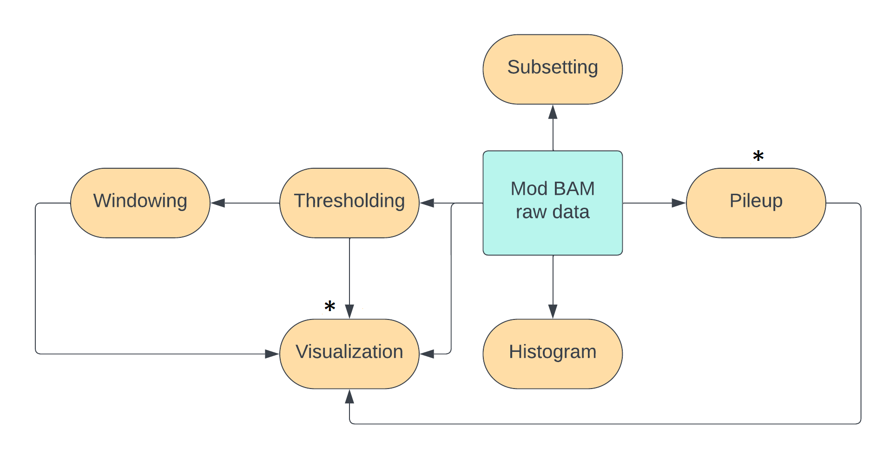
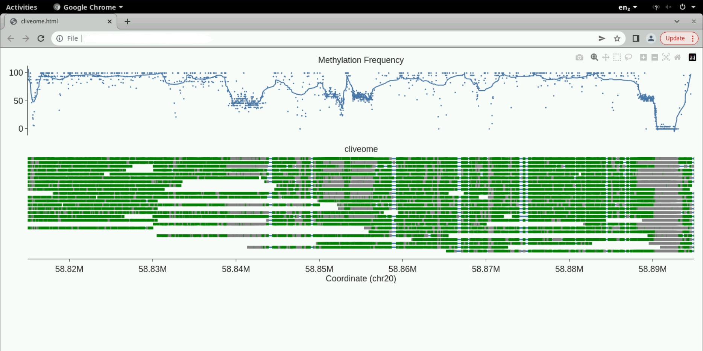

This is the final hands-on session in our timeline.
In this session, we will learn to use another visualization package `modbamtools`,
and learn how to do pileups.
At the end of the lesson, you can do an exercise to explore what you have learnt
in all the hands-on sessions in this course further or you can explore all the mod BAM
files we have generated and the commands you have used on your own.



## Visualizing reads and percent modification rates with modbamtools 

```bash
out_dir=~/nanomod_course_outputs/human/modbamtools
  # set to suitable directory
mkdir -p $out_dir # make directory if it does not exist

modbamtools plot -r chr20:58815000-58895000 \
  --out $out_dir --prefix cliveome --samples cliveome \
  ~/nanomod_course_data/human/bonito_calls.subset.sorted.bam
```

Open `cliveome.html` in the output directory.
You should see the screen below.



Top track is the percentage of methylation across reads versus coordinate
along the reference. The bottom tracks are individual molecules.
Move your mouse over them to see the read ids.
You can zoom in or zoom out of the plots using your mouse
on the top track.

One can optionally produce additional tracks to accompany the plot.
These can be annotations like genes or some signal versus the reference
coordinate produced by independent measurements.
Have a look at the modbamtools tutorial
[here](https://rrazaghi.github.io/modbamtools/tutorial/) to explore these options.
We have chosen the same genomic location as the example in the tutorial, so
we can compare the methylation pattern between the two examples.
We have chosen a green-grey colour scheme for our plots here compared
with the red-blue of the tutorial.

## Calculation of modification statistics with `modbamtools`

One can calculate modification statistics across several regions with `modbamtools`.

```bash
region_file=~/nanomod_course_outputs/human/modbamtools/regions.bed
# Use a non-existent filename above.
# We will populate this file using the echo commands below.
echo -e "chr20\t58100000\t58200000" > $region_file;   
echo -e "chr20\t59100000\t59200000" >> $region_file;

output_bed_file=~/nanomod_course_outputs/human/modbamtools/regions.mod.bed

modbamtools calcMeth --bed $region_file \
    --threads 3 \
    --out $output_bed_file \
    ~/nanomod_course_data/human/bonito_calls.subset.sorted.bam
```

A few columns are added to the output bed file: average percent modification,
standard deviation of modification, and the coverage.
This calculation offers us an alternate to `modkit sample-probs` as
the style of the input options is slightly different.

Although the command is called `modbamtools calcMeth`, it works
on our yeast dataset with BrdU-substituted DNA as well.

## Pileup of reference-anchored mod BAM files with `modkit`

A pileup is any calculation that produces one number per base on a reference
genome by performing an operation across all data available at that base
across all reads passing through that base.
In addition to the percent-modification track produced by `modbamtools`
above, we have also encountered pileups in the previous
[session]({{ site.baseurl }}/materials/genome-browser-visualization)
on visualization in genome browsers as shown in the figure below.


Per base on the reference genome, we can calculate
- the total number of reads
- the total number of modifications
- the fraction of modified reads

```bash
input_mod_bam=~/nanomod_course_data/human/bonito_calls.subset.sorted.bam
output_dir=~/nanomod_course_data/human/modkit_pileup
mkdir -p $output_dir
modkit pileup --no-filtering --mod-thresholds m:0.5\
  $input_mod_bam "$output_dir"/pileup.bed
```

Now, one can inspect a few lines from the output file

```bash
# inspect the first few lines
head -n 20 "$output_dir"/pileup.bed
# inspect a few randomly chosen lines
cat "$output_dir"/pileup.bed | shuf | head -n 20
```

You can find more details on what the columns mean in the modkit [documentation](https://github.com/nanoporetech/modkit).

<details markdown="1">

<summary markdown="span"> 

Optional: coverage using bedtools

</summary>

### Coverage using `bedtools`

An alternate way to get the coverage,
which is a count of the number of reads passing
through each base, one can do

```bash
input_mod_bam=         # fill suitably
output_dir=            # fill suitably
mkdir -p "$output_dir" # make output directory if need be
bedtools genomecov -ibam $input_mod_bam -bga >\
  "$output_dir"/coverage.bedgraph
```

Now, one can inspect a few lines from the output bedgraph

```bash
# inspect the first few lines
head -n 20 "$output_dir"/coverage.bedgraph
# inspect a few randomly chosen lines
cat "$output_dir"/coverage.bedgraph | shuf | head -n 20
```

This method will work even if all the reads in the BAM file
do not have any modifications.
This is because coverage is just a count of the number of reads
passing through each position on the reference.

</details>

<details markdown="1">

<summary markdown="span"> 

Optional: modification pileup with samtools

</summary>

### Modification pileup with `samtools`

One can also perform pileups of modification with `samtools`.
The command is specified below.
The output format is a little hard to understand and we will discuss its main features.
Please consult the documentation [here](https://www.htslib.org/doc/samtools-mpileup.html)
if you want to learn more.

```bash
input_mod_bam=~/nanomod_course_data/human/bonito_calls.subset.sorted.bam
output_file= # fill suitably
samtools mpileup -M $input_mod_bam \
  -r chr20:58815000-58895000 > $output_file
# we are restricting the pileup above to the specified region
```

We discuss the columns in the output file using the following three representative lines:

```text
chr20   58815129        N       17      gGGgggGgGgggggGgg       @EJB7E>{9>KGC@9@D
chr20   58815130        N       17      cC[+m255]C[+m255]cccC[+m255]cC[+m2]cccccC[+m255]cc      CCFB7E=F3AGDH=9CD
chr20   58815131        N       17      g[+m255]GGg[+m255]g[+m255]g[+m255]Gg[+m222]Gg[+m255]g[+m255]g[+m255]g[+m255]g[+m255]Gg[+m255]g[+m255]   CAGC=F=D2@J@D:9DD
```

- The first two columns are the contig and the position on the reference.
- The third column is the base at the reference, given here as the
  generic N as we have not supplied a reference genome in the input to the command.
- The fourth column is the number of reads passing through the position.
- The fifth column contains a series of bases.
  - The number of upper and lower case bases equals the number of
    forward-mapping and reverse-mapping reads at that position respectively.
  - If a read contains a modification, the corresponding base has square brackets
    appended to it. The modification code and probability from 0-255 appear
    in the square brackets (Recall from earlier that probabilities are stored
    as numbers from 0-255 and not as numbers from 0-1 in a mod BAM file).
  - The column contains additional information if there are insertions or
    deletions at this base in the reference. We are not going to discuss
    this here. 
- The sixth column has the base quality encoded as ASCII characters as we have
  discussed in a previous [session]({{ site.baseurl }}/materials/sequence-align-pycoqc)
  on sequence alignment.

This pileup command is useful if you want to do some sophisticated analysis
beyond the measures offered by `modkit` and `modbamtools`.
You can pass this as an input to a program written in python or R or any other
text processing tool.

</details>

<details markdown="1">

<summary markdown="span"> 

Optional exercise

</summary>

## Exercise: Measuring modification levels in our yeast dataset

In [this]({{ site.baseurl }}/exercises/compare_modification_levels) exercise,
we will measure modification levels at initiation sites and termination sites
in our yeast dataset and compare them.

</details>